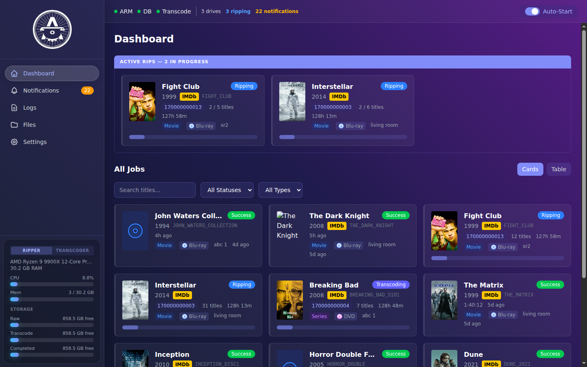

[](https://github.com/uprightbass360/automatic-ripping-machine-neu/actions/workflows/test.yml)
[](https://codecov.io/gh/uprightbass360/automatic-ripping-machine-neu)
[](https://github.com/uprightbass360/automatic-ripping-machine-neu/releases)
[](https://hub.docker.com/r/uprightbass360/automatic-ripping-machine)
[](LICENSE)

# Automatic Ripping Machine (ARM) - Neu

A fork of the [Automatic Ripping Machine](https://github.com/automatic-ripping-machine/automatic-ripping-machine) with many bug fixes, new features, and a companion service architecture for offloading GPU transcoding to a separate machine.

### What's different from upstream

**Architecture**
- Split into three independently-released services - ripper (this repo), [UI dashboard](https://github.com/uprightbass360/automatic-ripping-machine-ui), and [GPU transcoder](https://github.com/uprightbass360/automatic-ripping-machine-transcoder) - deployable on one host or across machines, with a [typed shared-contracts layer](https://github.com/uprightbass360/automatic-ripping-machine-contracts) keeping them in lockstep.

**What you'll see as a user**
- Modern SvelteKit + TypeScript dashboard replacing the Flask/Jinja UI, with real-time WebSocket job updates and phase-aware progress bars (rip / transcode / finalize)
- TVDB v4 episode matching for TV series discs - runtime-based track-to-episode mapping with a Browse/Match UI
- Database-driven preset system with per-job overrides, plus named-file overrides and a naming-preview before ripping starts
- Richer notifications (Apprise + webhooks with full job context) and auto-fetched MakeMKV community keydb at startup

**What you won't see (but will appreciate)**
- Auto-detected GPU encoding (NVIDIA NVENC, Intel QSV, AMD VAAPI, CPU fallback) gated on a functional probe so broken drivers don't get picked
- Durable webhook callbacks - the transcoder survives restarts without losing job notifications
- Graceful degradation when the transcoder is offline (ripper-only deployment is a first-class mode), and a long list of upstream bugs fixed in this fork

See [FORK_FEATURES.md](FORK_FEATURES.md) for the full breakdown.

## Related Projects

Part of the Automatic Ripping Machine (neu) ecosystem:

| Project | Description |
|---------|-------------|
| **automatic-ripping-machine-neu** | Fork of ARM with fixes and improvements (this project) |
| [automatic-ripping-machine-ui](https://github.com/uprightbass360/automatic-ripping-machine-ui) | Modern replacement dashboard (SvelteKit + FastAPI) |
| [automatic-ripping-machine-transcoder](https://github.com/uprightbass360/automatic-ripping-machine-transcoder) | GPU-accelerated transcoding service |
| [automatic-ripping-machine-contracts](https://github.com/uprightbass360/automatic-ripping-machine-contracts) | Typed shared-contracts layer keeping the services in lockstep |

Insert an optical disc (Blu-ray, DVD, CD) and ARM automatically detects, identifies, rips, and transcodes it. Headless and server-based, designed for unattended operation with one or more optical drives. This fork adds bug fixes, better notification payloads for external service integration, and improved compatibility with the companion transcoder and UI projects.

## Screenshots

| | |
|---|---|
|  |  |
| Dashboard with active rips and job cards | Job detail with per-episode track status |

More screenshots and theme examples in the [UI project README](https://github.com/uprightbass360/automatic-ripping-machine-ui#screenshots).

## Features

- Automatic disc detection via udev — insert a disc and walk away
- Identifies Blu-ray, DVD, CD, and data discs automatically
- Video discs: metadata lookup via OMDb/TMDb, rips with MakeMKV, queues transcoding
- Audio CDs: rips with abcde using MusicBrainz metadata
- Data discs: creates ISO backups
- TVDB episode matching for TV series discs (runtime-based track-to-episode mapping)
- Multi-drive parallel ripping with per-drive naming
- GPU-accelerated transcoding via companion service (NVIDIA, AMD, Intel, or CPU fallback)
- Notifications via Apprise (Discord, Slack, Telegram, email, and 30+ more), Pushbullet, Pushover, IFTTT, or custom scripts
- Modern dashboard UI with real-time job tracking, file browser, and settings management
- REST API for job management and external integrations
- Automatic MakeMKV community keydb updates for Blu-ray decryption
- Docker-first deployment — single-machine or split ripper/transcoder across hosts

## Requirements

- A system capable of running Docker containers
- One or more optical drives
- Storage for your media library (local or NAS)

## Quick Start

> For a detailed walkthrough (udev rules, MakeMKV registration, first-run config, troubleshooting), see [docs/setup.md](docs/setup.md).

### 1. Clone and configure

```bash
git clone --recurse-submodules https://github.com/uprightbass360/automatic-ripping-machine-neu.git
cd automatic-ripping-machine-neu
cp .env.example .env
```

Edit `.env` with your paths and settings. At minimum, set:

```bash
ARM_UID=1000
ARM_GID=1000
ARM_MUSIC_PATH=/home/arm/music
ARM_LOGS_PATH=/home/arm/logs
ARM_MEDIA_PATH=/home/arm/media
ARM_CONFIG_PATH=/etc/arm/config
```

### 2. Start the stack

```bash
# CPU-only transcoding (default — works on any hardware)
docker compose up -d

# With NVIDIA GPU for transcoding
docker compose -f docker-compose.yml -f docker-compose.gpu.yml up -d
```

This pulls versioned images for all three services:

| Service | Image | Default Port |
|---------|-------|-------------|
| ARM ripper | `uprightbass360/automatic-ripping-machine` | 8080 |
| UI dashboard | `uprightbass360/arm-ui` | 8888 |
| Transcoder | `uprightbass360/arm-transcoder` | 5000 |

### GPU Transcoding

The transcoder image tag determines GPU support. Set `TRANSCODER_VERSION` in your `.env`:

| GPU | `.env` setting | Additional setup |
|-----|---------------|-----------------|
| **None (CPU)** | `TRANSCODER_VERSION=latest` | None — uses software x265 |
| **NVIDIA** | `TRANSCODER_VERSION=latest-nvidia` | Use `docker-compose.gpu.yml` overlay, install [NVIDIA Container Toolkit](https://docs.nvidia.com/datacenter/cloud-native/container-toolkit/install-guide.html) |
| **Intel (QSV)** | `TRANSCODER_VERSION=latest-intel` | Add `/dev/dri` device to transcoder (see below) |
| **AMD (VAAPI)** | `TRANSCODER_VERSION=latest-amd` | Add `/dev/dri` device to transcoder (see below) |

**Intel / AMD setup:** The transcoder needs access to `/dev/dri` for hardware encoding. Create a `docker-compose.override.yml`:

```yaml
services:
  arm-transcoder:
    devices:
      - /dev/dri:/dev/dri
```

Then start normally with `docker compose up -d`. The override is automatically applied.

The transcoder auto-detects the GPU at startup and selects the right encoder and presets. You do **not** need to set `VIDEO_ENCODER` manually — leave it as `x265` and the auto-resolver will upgrade it if GPU hardware is found.

> **Common issue:** If transcoding fails with `HandBrake failed with exit code 3` or `Error creating a MFX session`, verify you're using the correct image tag for your GPU and that `/dev/dri` is accessible inside the container.

### 3. Verify

```bash
# ARM web interface
curl http://localhost:8080

# UI dashboard
curl http://localhost:8888

# Transcoder health
curl http://localhost:5000/health
```

Insert a disc and ARM handles the rest — rip, identify, and organize.

### Remote Transcoder

If your GPU is on a separate machine, use the split deployment:

```bash
cp .env.remote-transcoder.example .env
# Set TRANSCODER_HOST to the remote machine's IP
docker compose -f docker-compose.remote-transcoder.yml up -d
```

See the [transcoder README](https://github.com/uprightbass360/automatic-ripping-machine-transcoder) for setting up the remote side.

### Ripper-only

For ARM + UI on a single machine with no transcoder - the ripper writes final named files directly (no second-pass re-encode). Use this when the source quality is acceptable as-is or you don't need GPU transcoding at all:

```bash
cp .env.ripper-only.example .env
docker compose -f docker-compose.ripper-only.yml up -d
```

`TRANSCODER_ENABLED=false` is baked into the compose file: the UI hides all transcoder surfaces (nav link, settings tab, job-detail transcode controls, stats panels, log viewer) and the ripper falls into the `finalize_output` path. See [deploy/DEPLOY.md](deploy/DEPLOY.md#ripper-only-deployment) for details.

### Development

Clone all three repos as siblings and start the dev stack:

```bash
cd ~/src
git clone https://github.com/uprightbass360/automatic-ripping-machine-neu.git
git clone https://github.com/uprightbass360/automatic-ripping-machine-ui.git
git clone https://github.com/uprightbass360/automatic-ripping-machine-transcoder.git

cd automatic-ripping-machine-neu
cp .env.example .env  # edit as needed
docker compose -f docker-compose.yml -f docker-compose.dev.yml up -d --build
```

The dev overlay builds from sibling repos and bind-mounts source for hot-reload. See [docs/setup.md](docs/setup.md) for details.

> **Note:** `components/ui/` and `components/transcoder/` are git submodules managed by CI. Do not build from them during development.

## Docker Images

Pre-built images are published to Docker Hub and GHCR on every release:

| Component | Docker Hub | Purpose |
|-----------|-----------|---------|
| Base dependencies | `uprightbass360/arm-dependencies` | MakeMKV, system deps |
| ARM | `uprightbass360/automatic-ripping-machine` | Ripper application |
| UI | `uprightbass360/arm-ui` | Dashboard (SvelteKit + FastAPI) |
| Transcoder | `uprightbass360/arm-transcoder` | GPU-accelerated transcoding |

ARM, base dependencies, and transcoder images are built for `linux/amd64`. The UI image is multi-platform (`amd64` + `arm64`). The transcoder also publishes GPU-specific tag suffixes (`-nvidia`, `-amd`, `-intel`).

### Version Pinning

Pin all three versions in your `.env` for reproducible deployments (check each repo's releases for the latest version):

```bash
ARM_VERSION=X.Y.Z
UI_VERSION=X.Y.Z
TRANSCODER_VERSION=X.Y.Z
```

**Lockstep with the UI:** starting at v17.0.0, the ripper no longer exposes its SQLite database to the UI container. `ARM_VERSION` and `UI_VERSION` must be on the same major version - running an arm-ui image older than v17.0.0 against a v17.0.0+ ripper makes the UI fall back to "DB unavailable" because the shared `arm-db` mount is gone.

## Upstream

This project is forked from [automatic-ripping-machine/automatic-ripping-machine](https://github.com/automatic-ripping-machine/automatic-ripping-machine), originally created by Benjamin Bryan and maintained by the ARM community.

For detailed ARM configuration, see the [upstream wiki](https://github.com/automatic-ripping-machine/automatic-ripping-machine/wiki/).

## License

[MIT License](LICENSE)
