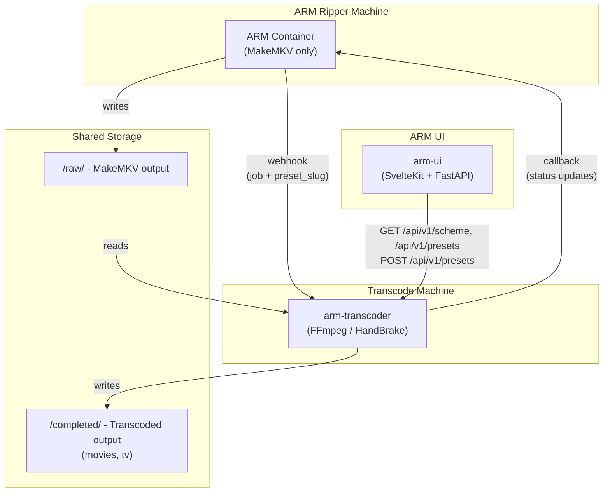

[](https://github.com/uprightbass360/automatic-ripping-machine-transcoder/actions/workflows/test.yml)
[](https://codecov.io/gh/uprightbass360/automatic-ripping-machine-transcoder)
[](https://github.com/uprightbass360/automatic-ripping-machine-transcoder/releases/latest)
[](https://hub.docker.com/r/uprightbass360/arm-transcoder)
[](https://hub.docker.com/r/uprightbass360/arm-transcoder)
[](https://hub.docker.com/r/uprightbass360/arm-transcoder)
[](https://hub.docker.com/r/uprightbass360/arm-transcoder)
[](LICENSE)

# ARM Transcoder

Part of the [Automatic Ripping Machine (neu) ecosystem](#related-projects). Hardware-accelerated transcoding service that offloads encoding from your ARM ripper to a dedicated transcode server. Supports NVIDIA, AMD, and Intel GPUs, or CPU-only software encoding.

## Related Projects

Part of the Automatic Ripping Machine (neu) ecosystem:

| Project | Description |
|---------|-------------|
| [automatic-ripping-machine-neu](https://github.com/uprightbass360/automatic-ripping-machine-neu) | Fork of the original ARM with bug fixes and improvements |
| [automatic-ripping-machine-ui](https://github.com/uprightbass360/automatic-ripping-machine-ui) | Modern replacement dashboard (SvelteKit + FastAPI) |
| **automatic-ripping-machine-transcoder** | GPU-accelerated transcoding service (this project) |
| [automatic-ripping-machine-contracts](https://github.com/uprightbass360/automatic-ripping-machine-contracts) | Typed shared-contracts layer keeping the services in lockstep |

The original upstream project: [automatic-ripping-machine/automatic-ripping-machine](https://github.com/automatic-ripping-machine/automatic-ripping-machine)

## Architecture



## Features

- Webhook receiver for ARM job completion notifications
- **Multi-worker concurrency** - spawn `MAX_CONCURRENT` worker tasks from a shared queue, configurable per GPU (NVIDIA 3-5, AMD 1-2, Intel 2-3, CPU 2-3)
- **Auto-detected GPU encoding** - detects NVIDIA, AMD, or Intel at startup and selects the right encoder and preset automatically
- Hardware-accelerated transcoding via FFmpeg (with HandBrake fallback for NVIDIA)
- Resolution-based encoding - 4K preserved, Blu-ray at 1080p, DVDs upscaled to 720p
- Multi-GPU support: NVIDIA NVENC, AMD VAAPI/AMF, Intel Quick Sync, software fallback
- **ARM callback** - notifies ARM when jobs complete or fail (`ARM_CALLBACK_URL`)
- **Non-blocking I/O** - all filesystem operations run off the event loop via thread pool, keeping API responsive during transcodes
- Queue management with SQLite persistence
- REST API with modular router architecture for job monitoring, worker status, and management
- API key authentication with role-based access (admin/readonly)
- Input validation and path traversal protection
- Local scratch storage to avoid heavy I/O on network shares (copy→transcode→move)
- Automatic source cleanup after successful transcode
- Per-worker status tracking with `/workers` endpoint for dashboard integration
- Pagination support on job listings
- Retry limits with tracking
- Disk space pre-checks

## Docker Images

Pre-built images are published to Docker Hub on every release:

```bash
docker pull uprightbass360/arm-transcoder:latest            # CPU-only (default, software x265/x264)
docker pull uprightbass360/arm-transcoder:latest-nvidia     # NVIDIA NVENC
docker pull uprightbass360/arm-transcoder:latest-amd        # AMD Radeon (VAAPI)
docker pull uprightbass360/arm-transcoder:latest-intel      # Intel Quick Sync (QSV)
```

For the full ecosystem quick start (ARM + UI + Transcoder), see the [ARM-neu README](https://github.com/uprightbass360/automatic-ripping-machine-neu#quick-start).

## Requirements

- Docker
- Shared storage between machines (NFS, SMB/CIFS, or any network/local mount)
- ARM configured for external transcoding (`SKIP_TRANSCODE: false` in `arm.yaml`)
- One of the following for encoding:

| Hardware | Requirements | Compose File | Encoder |
|----------|-------------|--------------|---------|
| **No GPU** | None | `docker-compose.yml` | `x265` |
| **NVIDIA** | NVIDIA Container Toolkit | `docker-compose.nvidia.yml` | `nvenc_h265` |
| **AMD Radeon** | `/dev/dri` device + mesa-va-drivers | `docker-compose.amd.yml` | `vaapi_h265` |
| **Intel** | `/dev/dri` device + intel-media-driver | `docker-compose.intel.yml` | `qsv_h265` |

## Setting Up with ARM

Step-by-step guide for a typical two-machine setup: an ARM ripper that rips discs and a separate transcode server with a GPU, connected by shared storage.

For Proxmox LXC deployment, see [docs/proxmox-lxc-setup.md](docs/proxmox-lxc-setup.md).

### 1. Set up shared storage

Both machines need access to the same directories via NFS, SMB/CIFS, or any network mount:

```
/mnt/media/raw         ← ARM writes raw MKV files here
/mnt/media/completed   ← Transcoder writes finished files here
```

ARM writes to `raw/`. The transcoder reads from `raw/` and writes to `completed/movies/` and `completed/tv/`.

### 2. Start the transcoder

On your transcode server:

```bash
git clone https://github.com/uprightbass360/automatic-ripping-machine-transcoder.git
cd automatic-ripping-machine-transcoder
cp .env.example .env
```

Edit `.env` with your shared storage paths:

```bash
HOST_RAW_PATH=/mnt/media/raw
HOST_COMPLETED_PATH=/mnt/media/completed
```

Start the container for your GPU:

```bash
docker compose up -d                                       # CPU-only (software x265)
docker compose -f docker-compose.nvidia.yml up -d          # NVIDIA NVENC
docker compose -f docker-compose.amd.yml up -d             # AMD Radeon (VAAPI)
docker compose -f docker-compose.intel.yml up -d           # Intel Quick Sync
```

Verify it's running:

```bash
curl http://localhost:5000/health
```

### 3. Configure ARM

On your ARM ripper, configure the transcoder webhook so ARM notifies the transcoder when a rip completes.

**Option A: Automated setup (recommended)**

Copy the setup script to your ARM machine and run it:

```bash
# Simple webhook (no auth)
./scripts/setup-arm.sh \
  --url http://TRANSCODER_IP:5000/webhook/arm \
  --config /etc/arm/config

# With webhook authentication
./scripts/setup-arm.sh \
  --url http://TRANSCODER_IP:5000/webhook/arm \
  --config /etc/arm/config \
  --secret your-webhook-secret \
  --restart
```

The script patches `arm.yaml`, deploys the notification script (when using `--secret`), and optionally restarts ARM.

**Option B: Manual setup**

Edit your ARM `arm.yaml`:

```yaml
# Transcoder webhook - ARM notifies the transcoder when a rip completes
TRANSCODER_URL: "http://TRANSCODER_IP:5000/webhook/arm"
TRANSCODER_WEBHOOK_SECRET: ""   # optional, must match WEBHOOK_SECRET on transcoder

# Keep transcoding enabled (false = send to transcoder, true = skip)
SKIP_TRANSCODE: false

# Rip settings
RIPMETHOD: "mkv"
DELRAWFILES: false
```

Replace `TRANSCODER_IP` with the IP or hostname of your transcode server.

### 4. Test the pipeline

Send a test webhook to verify connectivity:

```bash
curl -s -X POST http://TRANSCODER_IP:5000/webhook/arm \
  -H "Content-Type: application/json" \
  -d '{"title": "ARM notification", "body": "Test Movie (2024) rip complete. Starting transcode.", "type": "info"}'
```

A `200` response means the transcoder received the webhook. Check job status:

```bash
curl http://TRANSCODER_IP:5000/jobs
curl http://TRANSCODER_IP:5000/stats
```

### 5. Rip a disc

Insert a disc into your ARM ripper and let it rip. When the rip completes:

1. ARM sends a webhook to the transcoder
2. The transcoder finds the raw MKV files on shared storage
3. Files are transcoded with your GPU (resolution-aware - 4K preserved, DVDs upscaled to 720p)
4. Output is written to `completed/movies/` or `completed/tv/` (auto-detected)
5. Source files are cleaned up (if `DELETE_SOURCE=true`)


## Configuration

### Docker Environment Variables (.env)

These variables are used across all `docker-compose*.yml` files:

| Variable | Default | Description |
|----------|---------|-------------|
| `HOST_RAW_PATH` | *(required)* | Host path to ARM's raw output (shared storage mount) |
| `HOST_COMPLETED_PATH` | *(required)* | Host path for completed transcodes |
| `WEBHOOK_PORT` | 5000 | Port exposed on host |
| `WEBHOOK_SECRET` | *(empty)* | Secret for webhook authentication (see [Authentication](docs/AUTHENTICATION.md)) |
| `LOG_LEVEL` | INFO | Logging level (DEBUG, INFO, WARNING, ERROR) |
| `TZ` | America/New_York | Container timezone |

### Application Settings

| Variable | Default | Description |
|----------|---------|-------------|
| `SELECTED_PRESET_SLUG` | *(empty)* | Active preset slug (empty = scheme default) |
| `GLOBAL_OVERRIDES` | *(empty)* | JSON object of tier-scoped overrides applied on top of the active preset |
| `RAW_PATH` | /data/raw | Path to raw MKV files inside container. ARM sends a relative `input_path` in the webhook; transcoder joins to RAW_PATH. |
| `COMPLETED_PATH` | /data/completed | Path for completed transcodes inside container. ARM sends a relative `output_path` in the webhook; transcoder joins to COMPLETED_PATH. Type-subdir partitioning (Movies/0.Rips, TV/0.Rips, etc.) is set on ARM via MOVIES_SUBDIR/TV_SUBDIR/AUDIO_SUBDIR. |
| `OUTPUT_EXTENSION` | mkv | Output file extension |
| `DELETE_SOURCE` | true | Remove source after successful transcode |
| `MAX_CONCURRENT` | 1 | Max concurrent transcodes. NVIDIA: 3-5 sessions, AMD: 1-2, Intel: 2-3, CPU: 2-3. Default 1 unless verified. |
| `STABILIZE_SECONDS` | 60 | Seconds to wait for source files to stop changing |
| `MAX_RETRY_COUNT` | 3 | Maximum retry attempts for failed jobs (0-10) |
| `MINIMUM_FREE_SPACE_GB` | 10 | Minimum free disk space required (GB) |
| `REQUIRE_API_AUTH` | false | Require API key for endpoints |
| `API_KEYS` | *(empty)* | Comma-separated API keys (see [Authentication](docs/AUTHENTICATION.md)) |
| `ARM_CALLBACK_URL` | *(empty)* | ARM API base URL for status callbacks (e.g. `http://192.168.0.68:8080`) |
| `VAAPI_DEVICE` | /dev/dri/renderD128 | VAAPI/QSV render device path (AMD and Intel only) |
| `GPU_VENDOR` | *(auto, set by image)* | GPU vendor for live monitoring: `nvidia`, `amd`, `intel`, or empty. Set automatically by each Docker image layer. |

See `.env.example` for the full template.

### Encoder Options

| Hardware | Encoder | Description |
|----------|---------|-------------|
| AMD | `vaapi_h265` / `hevc_vaapi` | VAAPI H.265 (recommended for Radeon on Linux) |
| AMD | `vaapi_h264` / `h264_vaapi` | VAAPI H.264 |
| AMD | `amf_h265` / `hevc_amf` | AMF H.265 |
| AMD | `amf_h264` / `h264_amf` | AMF H.264 |
| Intel | `qsv_h265` / `hevc_qsv` | Quick Sync H.265 |
| Intel | `qsv_h264` / `h264_qsv` | Quick Sync H.264 |
| NVIDIA | `nvenc_h265` / `hevc_nvenc` | NVENC H.265 |
| NVIDIA | `nvenc_h264` / `h264_nvenc` | NVENC H.264 |
| None | `x265` | Software H.265 (no GPU required, slower) |
| None | `x264` | Software H.264 (no GPU required, slower) |

The scheme (nvidia, intel, amd, or software) is auto-detected from `GPU_VENDOR` at startup, which selects the matching built-in presets. Override by creating a custom preset via the `/api/v1/presets` API or the UI settings page.

## Resolution-Based Encoding

Each preset defines per-tier settings for three resolutions: `dvd` (< 720p), `bluray` (>= 720p), and `uhd` (>= 2160p). The transcoder automatically selects the tier from the input video and applies that tier's encoder + quality + HandBrake preset.

Built-in presets per scheme (nvidia, intel, amd, software) expose `balanced`, `quality`, and (where available) `fast` variants. Custom presets can be created via the UI or the preset CRUD API.

## API Endpoints

| Endpoint | Method | Auth | Description |
|----------|--------|------|-------------|
| `/health` | GET | None | Health check |
| `/webhook/arm` | POST | Webhook secret | Receive ARM notifications |
| `/jobs` | GET | API key | List jobs (supports `?status=` filter, `?limit=`, `?offset=`) |
| `/jobs/{id}/retry` | POST | Admin API key | Retry a failed job |
| `/jobs/{id}` | DELETE | Admin API key | Delete a job |
| `/stats` | GET | API key | Transcoding statistics (includes `active_count`, `max_concurrent`) |
| `/workers` | GET | API key | Per-worker status: id, processing state, current job, started_at |
| `/system/info` | GET | None | Static hardware identity (CPU, RAM, GPU support) |
| `/system/stats` | GET | None | Live metrics: CPU, memory, storage, GPU utilization |
| `/config` | GET | API key | Current transcoding configuration |
| `/config` | PATCH | Admin API key | Update runtime settings |
| `/api/v1/scheme` | GET | API key | Active scheme metadata (supported encoders + tiers) |
| `/api/v1/presets` | GET | API key | List built-in and custom presets |
| `/api/v1/presets/{slug}` | GET | API key | Fetch a single preset |
| `/api/v1/presets` | POST | Admin API key | Create a custom preset |
| `/api/v1/presets/{slug}` | PATCH | Admin API key | Update a custom preset |
| `/api/v1/presets/{slug}` | DELETE | Admin API key | Delete a custom preset |
| `/logs` | GET | API key | List available log files |
| `/logs/{file}` | GET | API key | Read log file contents |
| `/logs/{file}/structured` | GET | API key | Structured (JSON lines) log with `?level=`, `?search=` filters |
| `/system/restart` | POST | Admin API key | Gracefully restart the transcoder |

When `REQUIRE_API_AUTH=false` (default), API key auth is bypassed. See [docs/AUTHENTICATION.md](docs/AUTHENTICATION.md) for details.

## Monitoring

```bash
# View logs (use the compose file matching your GPU)
docker compose -f docker-compose.amd.yml logs -f arm-transcoder

# Check queue and stats
curl http://localhost:5000/stats

# List jobs (with optional filters)
curl http://localhost:5000/jobs
curl http://localhost:5000/jobs?status=failed
curl http://localhost:5000/jobs?limit=10&offset=0

# Live system metrics (CPU, memory, storage, GPU utilization)
curl http://localhost:5000/system/stats
```

### GPU Utilization

The `/system/stats` endpoint includes live GPU metrics when running a GPU-enabled image. Each Docker image layer sets `GPU_VENDOR` automatically:

| Image | Vendor | Metrics | Tool |
|-------|--------|---------|------|
| NVIDIA | `nvidia` | Utilization %, VRAM, temperature, encoder % | `nvidia-smi` |
| AMD | `amd` | Utilization %, VRAM, temperature | sysfs (`gpu_busy_percent`) |
| Intel | `intel` | Render engine %, video encoder % | `intel_gpu_top` |
| CPU-only | *(none)* | `"gpu": null` | - |

Example response:
```json
{
  "cpu_percent": 25.0,
  "cpu_temp": 55.0,
  "memory": { "total_gb": 16.0, "used_gb": 8.0, "free_gb": 8.0, "percent": 50.0 },
  "storage": [...],
  "gpu": {
    "vendor": "nvidia",
    "utilization_percent": 45.0,
    "memory_used_mb": 1024.0,
    "memory_total_mb": 8192.0,
    "temperature_c": 65.0,
    "encoder_percent": 78.0
  }
}
```

Fields are `null` when not available for a given vendor (e.g., Intel has no VRAM/temperature reporting).

### SKIP_TRANSCODE

When `true` in ARM's `arm.yaml`, ARM finalizes ripped files directly without sending them to the transcoder. The raw MKV files are moved to the completed directory as-is.

- Global default: set in `arm.yaml`
- Per-job override: toggle on the review panel before starting a rip
- Stuck jobs: use "Skip & Finalize" button on the job detail page

When using arm-transcoder, set `SKIP_TRANSCODE: false` so ARM sends ripped files to the transcoder for encoding.

## Troubleshooting

### GPU Not Detected

**AMD Radeon** - Verify VAAPI device and drivers:
```bash
# Check device exists on host
ls -la /dev/dri/renderD128

# Test inside container
docker compose -f docker-compose.amd.yml exec arm-transcoder vainfo
```

**Intel Quick Sync** - Verify QSV device:
```bash
ls -la /dev/dri/renderD128
docker compose -f docker-compose.intel.yml exec arm-transcoder vainfo
```

**NVIDIA** - Verify container toolkit:
```bash
docker run --rm --gpus all nvidia/cuda:12.2.0-base-ubuntu22.04 nvidia-smi
```

### Webhook Not Receiving

1. Check ARM logs for notification attempts
2. Verify network connectivity between machines
3. Check `TRANSCODER_URL` in ARM config matches transcoder address
4. If using `WEBHOOK_SECRET`, ensure ARM sends `X-Webhook-Secret` header

The transcoder accepts two webhook formats:

**Apprise format** (default ARM notifications):
```json
{
  "title": "ARM notification",
  "body": "Rip of Movie Title (2024) complete",
  "type": "info"
}
```

**Custom format** (via ARM's `BASH_SCRIPT`):
```json
{
  "title": "Movie Title",
  "path": "Movie Title (2024)",
  "job_id": "123",
  "status": "success"
}
```

The transcoder extracts the title and looks for files in `RAW_PATH/<directory name>/`.

### Transcode Fails

1. Check job error: `curl http://localhost:5000/jobs?status=failed`
2. Verify source files exist in `RAW_PATH`
3. Verify sufficient disk space (default minimum: 10GB free)
4. Check container logs for FFmpeg/HandBrake error output

### Authentication Errors

See [docs/AUTHENTICATION.md](docs/AUTHENTICATION.md) for setup and troubleshooting.

## Testing

```bash
# Install test dependencies
pip install -r requirements-test.txt

# Run all tests
python -m pytest tests/ -v
```

## License

[MIT License](LICENSE)
