[](https://github.com/uprightbass360/automatic-ripping-machine-ui/actions/workflows/test.yml)
[](https://codecov.io/gh/uprightbass360/automatic-ripping-machine-ui)
[](https://github.com/uprightbass360/automatic-ripping-machine-ui/releases/latest)
[](https://hub.docker.com/r/uprightbass360/arm-ui)
[](LICENSE)

# ARM UI

Part of the [Automatic Ripping Machine (neu) ecosystem](#related-projects). A modern replacement dashboard for the original ARM Flask/Jinja2 web interface.

Built with SvelteKit 2 and FastAPI, providing a unified view of ARM ripping jobs and GPU transcoding status in a mobile-first, dark-mode interface that scales from phone to desktop.

## Related Projects

Part of the Automatic Ripping Machine (neu) ecosystem:

| Project | Description |
|---------|-------------|
| [automatic-ripping-machine-neu](https://github.com/uprightbass360/automatic-ripping-machine-neu) | Fork of the original ARM with bug fixes and improvements |
| **automatic-ripping-machine-ui** | Modern replacement dashboard (this project) |
| [automatic-ripping-machine-transcoder](https://github.com/uprightbass360/automatic-ripping-machine-transcoder) | GPU-accelerated transcoding service |
| [automatic-ripping-machine-contracts](https://github.com/uprightbass360/automatic-ripping-machine-contracts) | Typed shared-contracts layer keeping the services in lockstep |

The original upstream project: [automatic-ripping-machine/automatic-ripping-machine](https://github.com/automatic-ripping-machine/automatic-ripping-machine)

## Screenshots

| | |
|---|---|
|  | 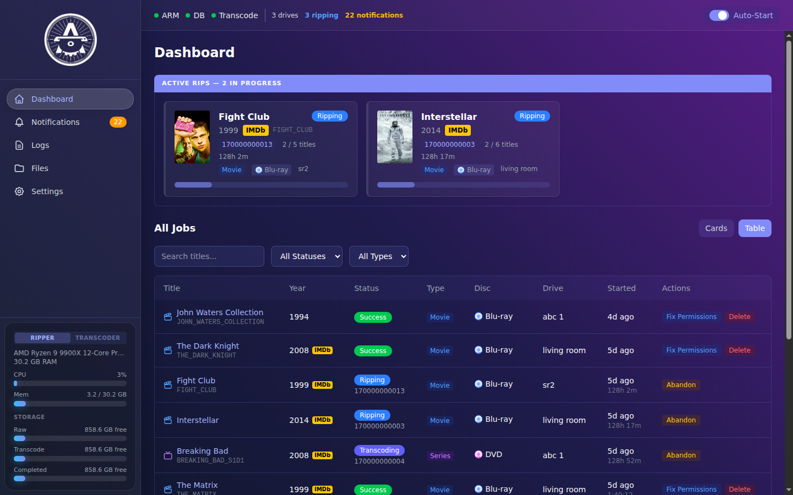 |
| Dashboard with active rips and job cards | Table view with filtering and bulk actions |
| 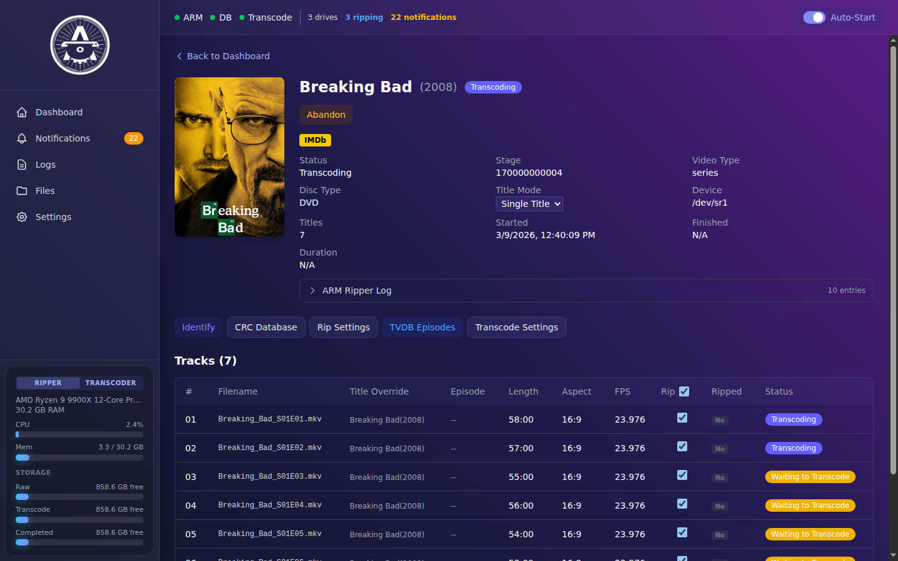 | 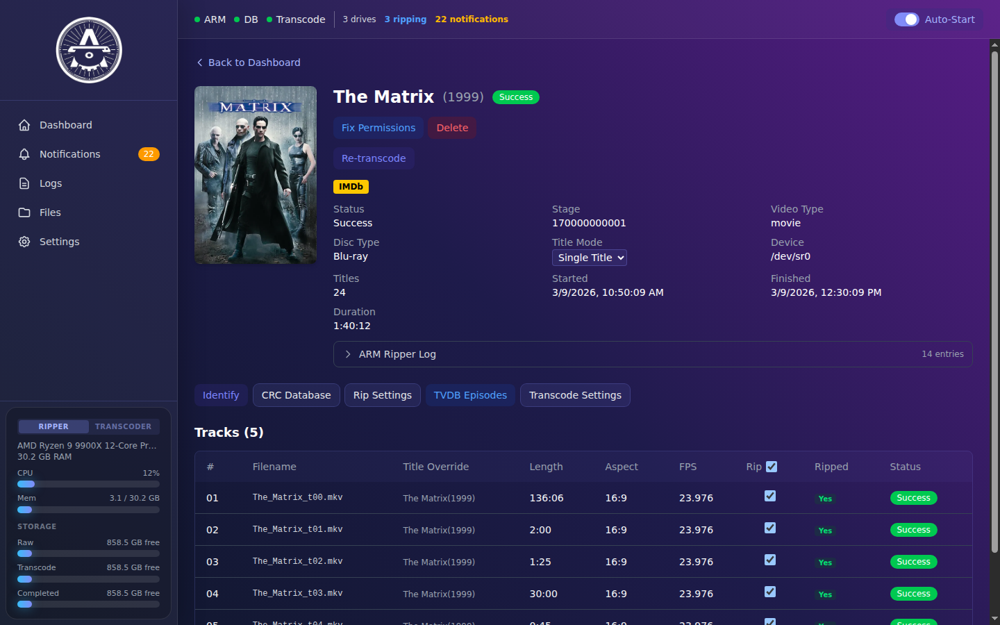 |
| TV series with per-episode track status | Movie detail with poster and metadata |
| 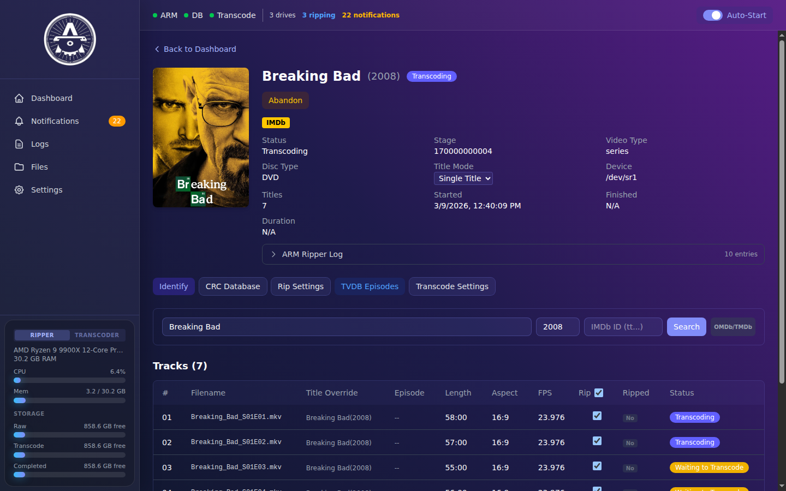 | 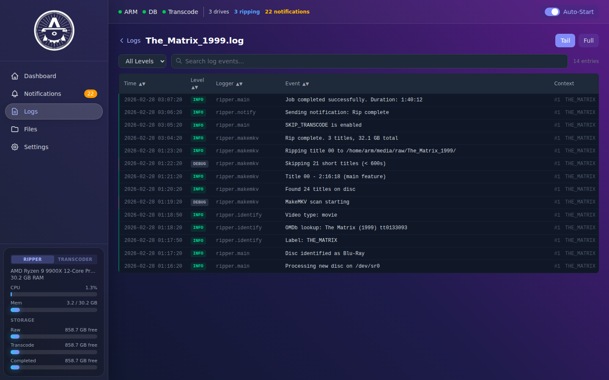 |
| Title search and re-identification | Structured log viewer with filtering |
| 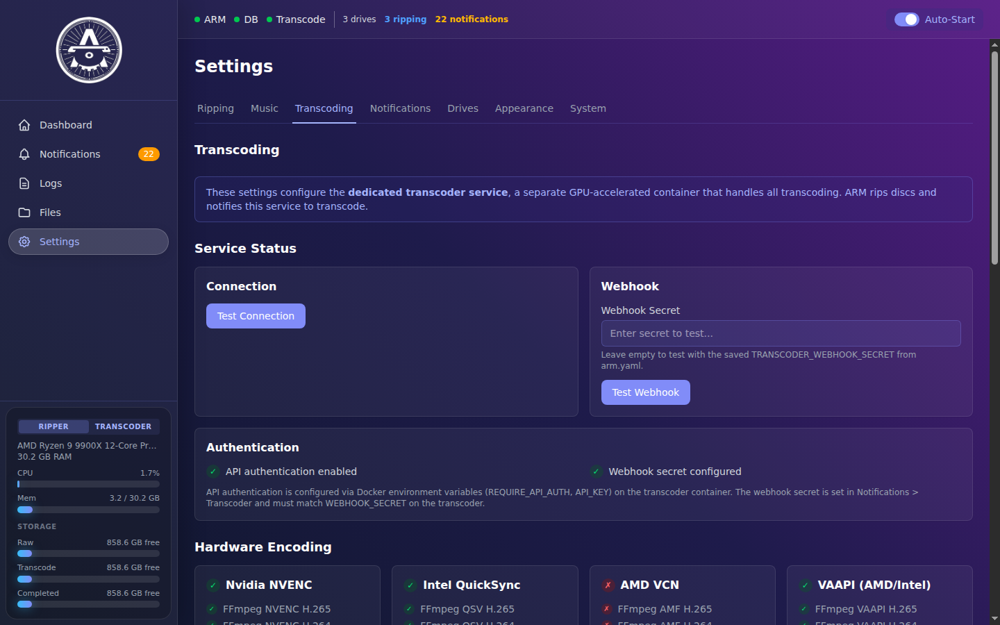 | 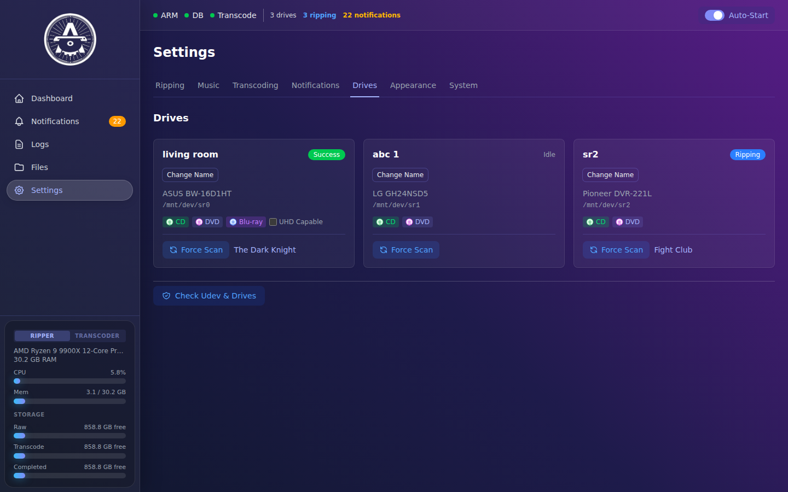 |
| GPU hardware detection and encoder config | Multi-drive management and status |
| 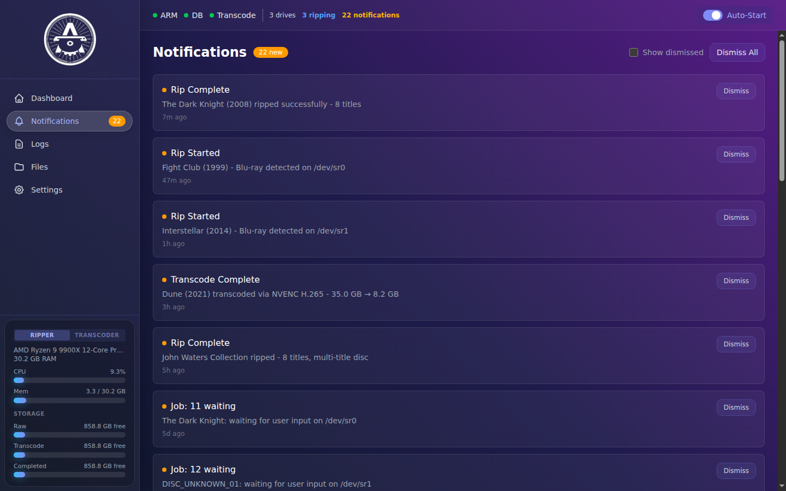 | 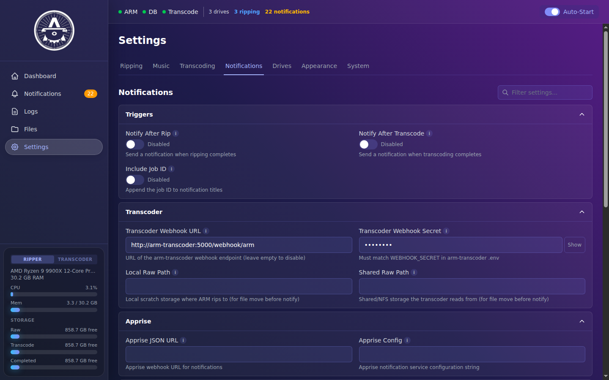 |
| Notification history | Webhook, Apprise, Pushbullet, and more |
| 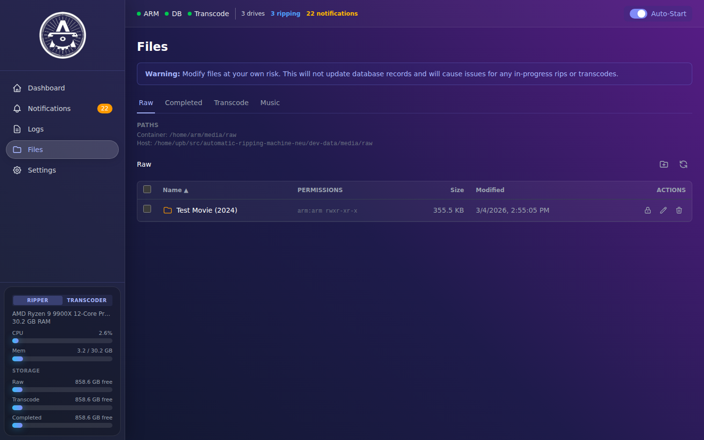 | 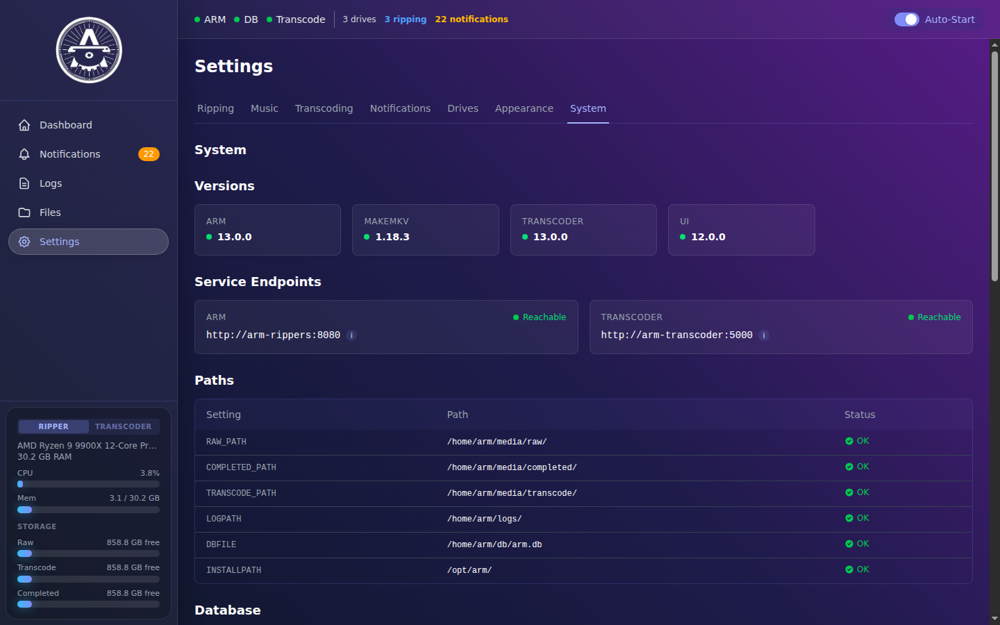 |
| File browser with permissions management | System info, versions, and health checks |

### Themes

30 built-in color schemes available under Settings > Appearance, with custom themes loadable from a config directory and runtime CSS injection (no rebuild needed to add a theme).

| | |
|---|---|
| 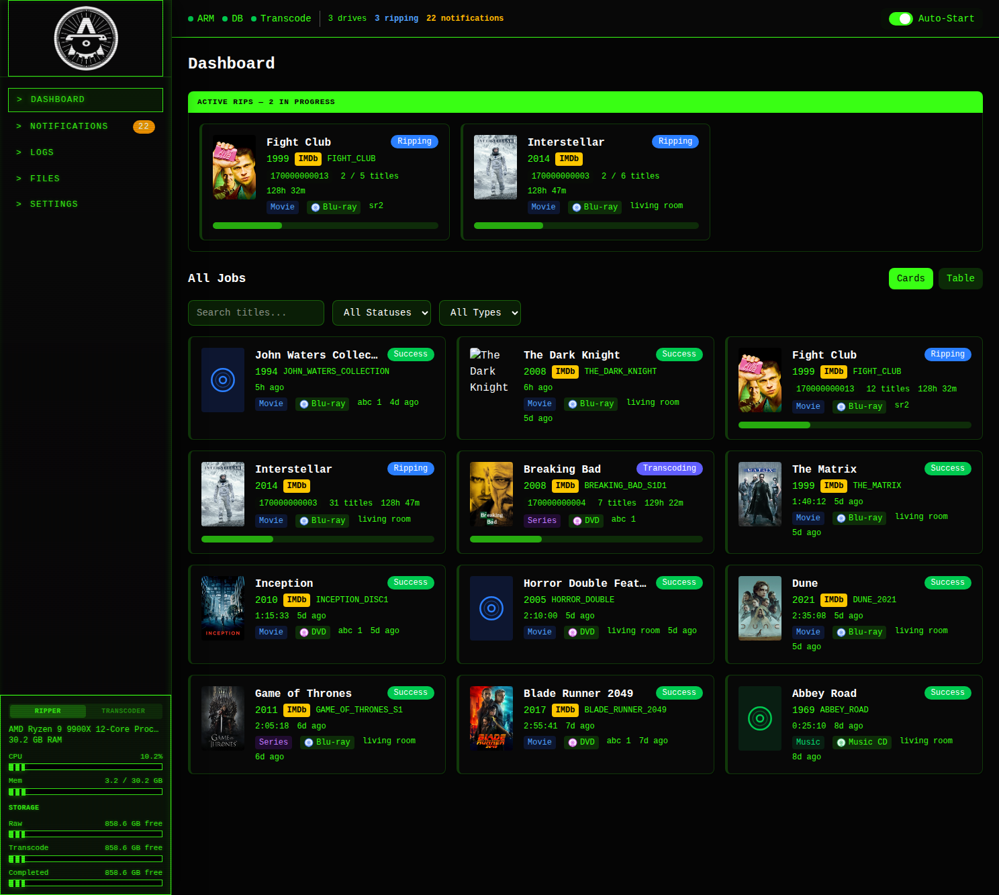 | 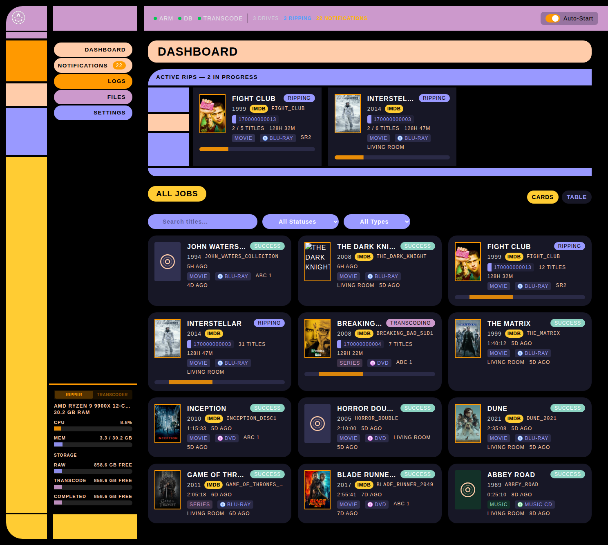 |
| Terminal | LCARS |

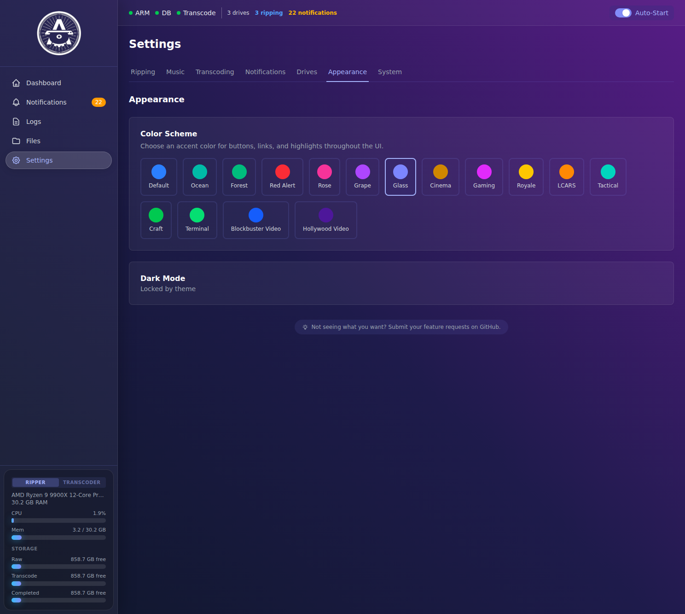

## Architecture

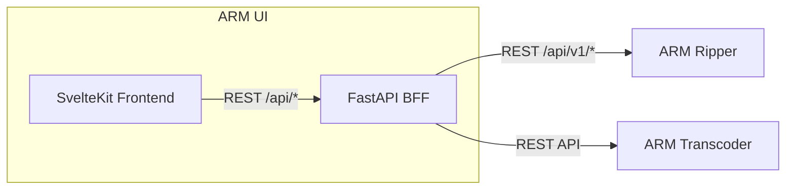

The backend is a thin BFF (backend-for-frontend) that aggregates calls to the ripper's HTTP API and the transcoder's REST API into single dashboard-shaped responses for the SvelteKit frontend. As of v17.0.0 the BFF holds no database connection - all job data, drives, notifications, and config live behind the ripper's `/api/v1/*` endpoints. Requires arm-neu >= v17.0.0.

## Features

- Real-time dashboard with card and table views, filtering by status/type, and search
- Active rip progress tracking with title counts and elapsed time
- Dashboard FINISHING section: jobs in the copying / waiting-transcode / ejecting phases get their own section between Active Rips and Transcoding instead of showing stale 100% rip progress
- Live job progress: phase-aware progress widget on the job detail page that shows MakeMKV progress during rip, indeterminate bars during copying / waiting-for-transcoder, and transcoder progress during transcode
- Job detail with poster art, metadata, IMDb links, and per-track status
- Job management: abandon, delete, fix permissions, toggle multi-title mode
- Recovery actions: Skip Transcode & Finalize button (moves raw files to completed without transcoding, for when the transcoder is unavailable) and Force Complete (marks stuck jobs as successful) on the job detail page, both with confirmation dialogs
- Metadata search: OMDb/TMDb (video), MusicBrainz (audio) with card flip tracklist preview
- TVDB episode matching for TV series discs with runtime-based track-to-episode mapping
- Structured metadata editing (artist, album, season, episode)
- Preset picker: scheme-aware encoding presets (NVIDIA / Intel / AMD / software). Built-in balanced/quality/fast presets per scheme plus user-created custom presets, with per-tier customization for DVD / Blu-ray / UHD
- SKIP_TRANSCODE toggle: global setting on the Ripping tab plus per-disc override in the review panel, for rip-only workflows that don't need a transcoder
- Transcoder integration: job monitoring with webhook-driven status updates
- Structured log viewer with level filtering, search, and tail/full modes; structured log filtering with level dropdown plus search box on the inline log panels, for narrowing to warnings/errors or grepping by phrase
- File browser with Raw/Completed/Transcode/Music tabs, permissions display, rename, and delete
- Drive status monitoring with CRC database lookup
- System stats sidebar: CPU, memory, and storage usage for ripper and transcoder
- Service health indicators (ARM, DB, Transcoder) in the status bar
- Notification history with read/unread and bulk actions
- Full ARM and transcoder settings management from the UI
- 30 built-in color schemes (Default, Ocean, Forest, Terminal, LCARS, Dracula Pro, Hollywood Video, and more) with runtime CSS injection - drop a theme JSON/CSS pair into the config directory and it loads without a rebuild
- Mobile-first responsive layout: dashboard, jobs list, job detail, settings, and logs all collapse cleanly to phone width. Hamburger drawer with a Menu/Stats segmented toggle on small screens, sticky app bar, iOS safe-area insets, and a `.responsive-table` pattern that stacks tables into labeled cards below the `lg` breakpoint

## Tech Stack

**Frontend:** SvelteKit 2, Svelte 5, TypeScript 6, Tailwind CSS 4, Vite 8

**Backend:** FastAPI BFF, httpx, Pydantic Settings, Uvicorn (HTTP-only against the ripper - no DB driver)

## Docker Images

Pre-built multi-platform images (`amd64`, `arm64`) are published to Docker Hub on every release:

```bash
docker pull uprightbass360/arm-ui:latest
```

For the full ecosystem quick start (ARM + UI + Transcoder), see the [ARM-neu README](https://github.com/uprightbass360/automatic-ripping-machine-neu#quick-start).

## Standalone Quick Start

If running the UI separately (outside the ARM-neu docker-compose):

```bash
git clone https://github.com/uprightbass360/automatic-ripping-machine-ui.git
cd automatic-ripping-machine-ui
cp .env.example .env
```

Edit `.env` with your service URLs (the UI talks to the ripper over HTTP, no shared database):

```bash
ARM_UI_ARM_URL=http://ARM_IP:8080
ARM_UI_TRANSCODER_URL=http://TRANSCODER_IP:5000
```

Start with Docker:

```bash
docker compose up -d
```

The UI is available at `http://localhost:8888`.

## Configuration

| Variable | Default | Description |
|----------|---------|-------------|
| `ARM_UI_ARM_URL` | `http://localhost:8080` | ARM web UI base URL (for job actions) |
| `ARM_UI_TRANSCODER_URL` | `http://localhost:5000` | Transcoder API base URL |
| `ARM_UI_TRANSCODER_API_KEY` | *(empty)* | Optional transcoder API key |
| `ARM_UI_TRANSCODER_WEBHOOK_SECRET` | *(empty)* | Webhook secret for outbound transcoder calls. Must match `WEBHOOK_SECRET` on the transcoder host. Read once at startup; rotation requires a container restart. |
| `ARM_UI_TRANSCODER_ENABLED` | `true` | Set `false` for ripper-only deployments (no transcoder). Hides all transcoder UI surfaces and short-circuits transcoder HTTP calls. See [ripper-only deployment](https://github.com/uprightbass360/automatic-ripping-machine-neu#ripper-only) in the ARM-neu README. |
| `ARM_UI_THEMES_PATH` | `/data/themes` | Directory for custom color scheme JSON/CSS files |
| `ARM_UI_IMAGE_CACHE_PATH` | `/data/cache/images` | Directory for cached poster/cover images |
| `ARM_UI_PORT` | `8888` | Server port |

## License

[MIT License](LICENSE)
