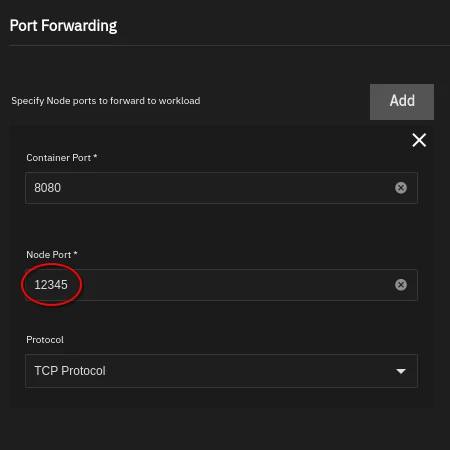
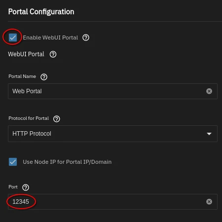

# TrueNAS Installation Guide

> [!CAUTION]
> This installation method is not supported or maintained by the ARM Developers.
> For full support and continued maintenance,
> we recommend installing ARM via the supported [Docker Container](https://github.com/automatic-ripping-machine/automatic-ripping-machine/wiki/docker).
> This installation method was developed for those that wish to use ARM without Docker.
>
> **Use at your own risk** 

This is a step-by-step walkthrough adding ARM (Automatic Ripping Machine) to a
TrueNAS Scale system as a custom app.

**Note**: The following guide was performed on TrueNAS Scale Cobie (24.04).
Prior versions of TrueNAS Scale have an issue with GPU Allocation, which Cobia fixes.

1. **Create App**

    Create a custom app via Apps → Discover Apps → Custom App 

> [!TIP]
> 
> Refer to the TrueNAS Documentation for additional information:
> [Documentation Hub](https://www.truenas.com/docs/scale/24.04/scaletutorials/apps/usingcustomapp/)

2. **Set the App Name**

    Name the Application, e.g. `arm`, `autorip`, or any other arbitrary name.

3. **Set the Repository**

    Set the *Image Repository* to `automaticrippingmachine/automatic-ripping-machine`
    and leave the _Image Tage_ on `latest`.

4. **Managing Permissions**

    The ARM container's internal user has User ID (`uid`) `1000` and Group ID (`gid`) `1000`.
    In most TrueNAS Scale installations, no user or group with this ID exists, and directory/file permissions 
    are likely not these ids. Therefore, you will need to make sure the container user has read and write permissions
    in the paths you will be setting in Step 6.
    
    You have 2 choices for this:
   - **Preferred**:
   In the **Container Environment Variables** section add the variables `ARM_UID` and `ARM_GID` and set both
   to `568`. This is TrueNAS' default `apps` user/group, which will most likely already have access to your
   directories and files.
   - **Alternate**:
   Adjust the directory and file permissions to allow read/write access for user and group ID `1000`,
   either by `chown`ing the directories/files, or adding corresponding ACLs.

5. **Port Forwarding**

    Enable port forwarding to allow access to ARM outside the docker container.
    ARM uses a default internal port of `8080`, configure the 'Node Port' to any unused port.

    | Container Port | Node Port     | Protocol         |
    |----------------|---------------|------------------|
    | `8080`           | `<your port>` | `TCP Protocol`   |

    Where `your-port` is the port the WebUI will be reachable at later. 
    Make sure it does not conflict with a port of your other Apps.

    

6. **Storage**

    Under **Storage** you need to map the 5 directories listed below.
    Note the *Host Paths* need to be created ahead of time to show up in the *Host Path* selector.
    Where you put these is your choice, but specifically for the `media` and `music` volumes,
    a path on your storage pools is highly recommended. For a reference what each of these directories are used for,
    read our guide on [Understanding Docker Volumes for A.R.M.](https://github.com/automatic-ripping-machine/automatic-ripping-machine/wiki/docker#understanding-docker-volumes-for-arm).
    
    Next to *Host Path Volumes* click *Add* and configure the following directories:

    | Local Path                     | ARM Docker Directory |
    |--------------------------------|----------------------|
    | `<path_to_arm_user_home_folder>` | `/home/arm`            |
    | `<path_to_music_folder>`         | `/home/arm/music`      |
    | `<path_to_logs_folder>`          | `/home/arm/logs`       |
    | `<path_to_media_folder>`         | `/home/arm/media`     |
    | `<path_to_config_folder>`        | `/etc/arm/config`     |
   
> [!IMPORTANT]  
> Please make sure to ***not*** check any of the *Read Only* boxes.

7. **Media Drives**

    Assign the required CD, DVD or Blu-ray drives in the system to ARM.

    _needs verification, see PR comments_
    
    In the **Workload Details** section under *Security Context*, enable the *Privileged Mode* checkbox.

> [!WARNING]  
> As of the current TrueNAS Scale Cobia release, there seems to be no way to pass only a single drive to a Docker container.
> This may change in Electric Eel with the replacement of the Kubernetes Engine in favor of Docker Compose.
> 
> That being said, running containers in
> [Privileged Mode comes with inherent security risks](https://docs.docker.com/security/faqs/containers/).
> If you are not comfortable with this, you may want to hold off for now and check back later after Electric Eel is released.

8. **GPU Configuration** (Optional) 

   If you don’t have a compatible GPU or wish to keep your video files raw,
    you can skip this step as this is only required for transcoding.
    Continue down to the **Resource Reservation** section and into the *GPU Configuration*
    If you do, continue down to the **Resource Reservation** section. Under *GPU Configuration* allocate at least a
    single one of the compatible GPUs to enable the NVENC.
    It will show you multiple GPUs that you can allocate, choose at least one.

> [!IMPORTANT]  
> 
> For NVIDIA GPUs, not only do you need to allocate your GPU, but you must also add a pair of variables in the **Container Environment Variables** section:
> - Name: `NVIDIA_VISIBLE_DEVICES` Value: `all`
> - Name: `NVIDIA_DRIVER_CAPABILITIES` Value: `all`

9. **Enable Web Portal** (Optional) 
    
    Not a necessary step, but this will create a button on the ARM app in TrueNAS Scale
    to allow quick access to the ARM Web GUI.
    _Note:_ Port forwarding is required to enable the Web Portal

    

10. **Install**

    Click the *Install* button at the bottom and wait for it to complete.

If everything was done properly, ARM should now work.
Head into the WebGUI either using the web portal button on the ARM app if you made one
or using the `ip:port` in the browser to check if ARM is working.

### Contributors:
* provscan (via discord)
* [mihawk90](https://github.com/mihawk90)
