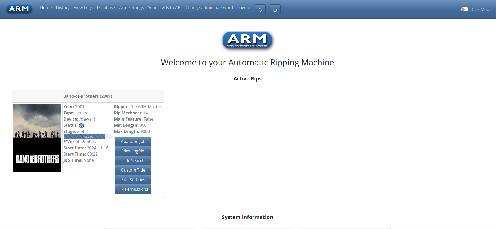

# ARM Job Management
<!-- TOC -->
* [ARM Job Management](#arm-job-management)
  * [Overview](#overview)
  * [Main Page](#main-page)
  * [Jobs Page](#jobs-page)
    * [Job Modes](#job-modes)
      * [Auto (Default)](#auto-default)
      * [Manual](#manual)
<!-- TOC -->

## Overview

The ARM Settings page provides an overview of the connected CD, DVD or Bluray drives connected to the system.
Scanning for drives allows easier management, viewing and status of jobs running on the ARM system.

## Main Page

The ARM home page shows all currently processing jobs and options to edit or fix metadata.
Any new jobs will automatically show up on this page, with the data refreshed per the UI Settings refresh rate.
See [UI Settings](Web-Settings-UI) for more details.

1. Abandon Job - Stop ARM processing the job, will kill any ripping or transcoding job.
2. View logfile - Open up the current job logfile in the browser
3. Title Search - Fix the title, sometime auto-detect works, this is for when it doesn't
4. Custom Title - For disks or jobs that are not standard, set a custom title
5. Edit Settings - Edit ripper or other settings (needs to be early on in the job)
6. Fix Permissions - Fix permissions using the chmod values for any files generated by ARM for the job

## Jobs Page

The Jobs page shows any current or already completed jobs in detail.

### Job Tracks

The track listing against A.R.M jobs lists music or video files that are to be processed.
When running in Manual mode, additional configuration options are provided (detailed below), to rip single tracks.

### Job Modes

A.R.M has two modes, automatic (default) and manual, allowing for additional configuration over jobs and drives.
For details on how to view and change job types, see [Drive Management](Web-Settings-Drives).

#### Auto (Default)

A.R.M does not stop at any point for user input,
using the Ripper Configuration provided any jobs will power through till the end.

#### Manual

When set to manual, A.R.M will pause and wait for user input on what jobs to process.
The process follows:

1. Job starts
2. Track information is read from the disk
3. Job is paused, waiting for user input on which tracks to select

> [!NOTE]
> A.R.M will wait for 30 minutes for input. If no input is provided the job will be abandoned.
> Reminders will be sent every 5 minutes that the job is waiting for input

4. **User interaction** Select and save tracks to rip.
   The below image shows the track selection options, select one or more tracks in the 'Process' column then select update.

> [!NOTE]
> Only one track selection can be conducted, once updated there is no going back.

5. Job continues on, ripping and transcoding like normal

Once a job has been completed user selection of tracks is not possible, with the track 'Process' selection disabled.

