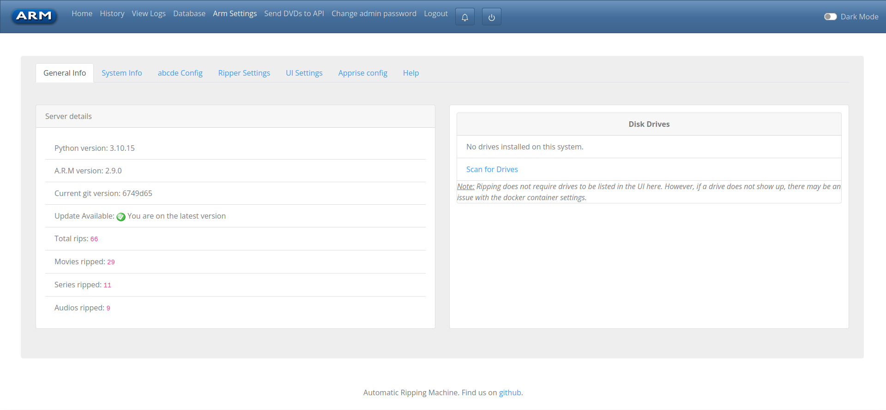

# ARM Drive Management
<!-- TOC -->
* [ARM Drive Management](#arm-drive-management)
  * [Overview](#overview)
  * [Drive Settings](#drive-settings)
    * [1. Scanning For New Drives](#1-scanning-for-new-drives)
    * [2. Edit Drive Details](#2-edit-drive-details)
      * [3. Eject or Close Drive](#3-eject-or-close-drive)
    * [4. Drive Options](#4-drive-options)
      * [3.1. Update Fields](#31-update-fields)
      * [3.2. Manual Start](#32-manual-start)
      * [3.3 Remove a Drive](#33-remove-a-drive)
<!-- TOC -->

## Overview

The ARM Settings page provides an overview of the connected CD, DVD or Bluray drives connected to the system.
Scanning for drives allows easier management, viewing and status of jobs running on the ARM system.

> [!NOTE]
> For ARM to rip media the drives do not need to appear on the settings, drive page.
> However, if ARM cannot find a drive following a scan, there may be issues with the docker configuration.

## Drive Settings

The following options are available from the ARM settings page, for each of the connected CD, DVD or Blu-ray drives.

1. Scan for Drives
2. Edit Drive Details
3. Drive Options

### 1. Scanning For New Drives

To add a new drive to the ARM system, select 'Scan for Drives'
ARM will scan the system looking for any new drive on the system, and associate any previous jobs to the drive.

Once ARM has scanned the system, the following information will be presented as detailed below.

### 2. Edit Drive Details

Drive names and descriptions can be modified to help in finding the right drive.
As great as knowing a drive is `sr0` or `sr1`, adding in a description like 'top disk - Blu-ray' can help put the disk in the right drive.
Especially for users with multiple drives in a system.

For more details on how jobs are processed, see [Jobs](Web-Jobs)

| Field        | Details                                                        | System or User |
|--------------|----------------------------------------------------------------|----------------|
| Name         | Defaults to `Drive x` where x is the total number of drives    | User editable  |
| Type         | Type of drive, CD, DVD or Bluray or combination of all three   | System field   |
| Mount Path   | System mount path reported                                     | System field   |
| Current Job  | When the drive is processing a job, current jobs will be shown | System field   |
| Previous Job | Once competed, previous or old jobs will be shown              | System field   |
| Description  | User defined description for the drive                         | User editable  |
| Drive Mode   | Set ARM to Auto or Manual, to allow additional configuration   | User editable  |

#### 3. Eject or Close Drive

Using the ARM webpage, it is possible to open (eject) and close specific drives
Handy if you have a lot of drives and still not quite sure which drive you need.
On ejecting the drive, ARM reports the drive as being open, as shown below.

**Drive Open**

**Drive Closed** _Default_

### 4. Drive Options

There are a few options available against each drive
1. Update Fields
2. Manual Start
3. Remove

#### 3.1. Update Fields

Once edited, save any user-configurable fields to the database.

#### 3.2. Manual Start

Sometimes ARM does its best, but like all good programs humans are a lot better.
The manual start allows users to kick off ARM if the udev or other rules don't get going automatically.
This shouldn't be needed all the time, but sometimes it helps.

**Manual job successful start**

**Manual job failed to start**

> [!NOTE]
> Errors in manual starting will be reported to the ARM docker logs.
> Accessible using `docker logs -f <container-name>`

#### 3.3 Remove a Drive
Sometimes you might just get to a point where removing a drive is necessary.
A drive might give up and just quit, removing it from the ARM web page makes life easier and cleaner.

> [!NOTE]
> If you remove a drive accidentally, don't worry.
> Simply running the 'Scan for Drives' will return all drives back if you accidentally remove the wrong drive.

