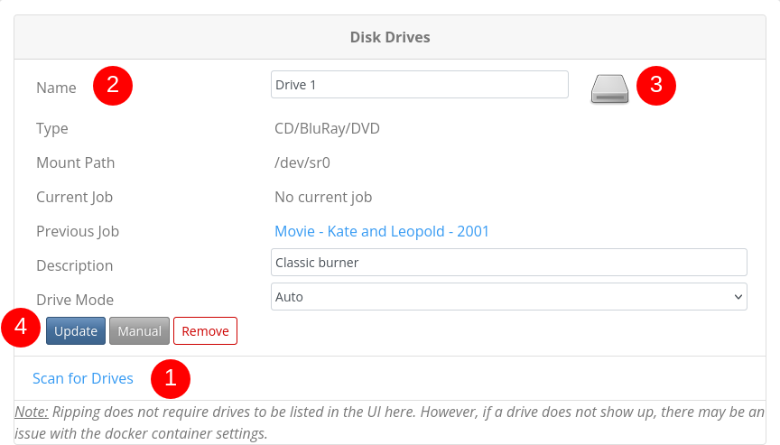

# ARM Settings - Drive Management

<!-- TOC -->
* [ARM Settings - Drive Management](#arm-settings---drive-management)
  * [Drive Settings](#drive-settings)
    * [1. Scanning For New Drives](#1-scanning-for-new-drives)
    * [2. Edit Drive Details](#2-edit-drive-details)
      * [3. Eject or Close Drive](#3-eject-or-close-drive)
    * [4. Drive Options](#4-drive-options)
      * [3.1. Update Fields](#31-update-fields)
      * [3.2. Manual Start](#32-manual-start)
      * [3.3 Remove a Drive](#33-remove-a-drive)
<!-- TOC -->

## Overview

The ARM Settings page 'General Info' tab provides an overview of the connected CD, DVD or Bluray.
drives connected on the system. Scanning for drives makes it easier to manage, view, and
track the job status running on the ARM system.

> [!NOTE]
> For ARM to rip media, the drives don't need to be visible on the settings
> page. However, if ARM can't find a drive following a scan, there might be
> issues with the docker configuration.

## Drive Settings

The following options are available from the ARM Settings page:

1. Scan for Drives
2. Drive Details
3. Drive Status (eject)
4. Drive Actions
5. User Editable
6. Hover Information
7. Job Information
8. Serial Number

### 1. Scan for New Drives

To add a new drive to the ARM system, select 'Scan for Drives'. This will scan
the system for any new drives and associate previous jobs with the drive.

Once ARM has scanned the system, the following information will be presented as
detailed below.

### 2. Drive Details

An optical drive has some information fixed and other information changes
depending on the state of the system. Drive Maker, Model, and Serial Number can
be considered as fixed information. This information is displayed on the top of
the collapsible Drive Details Card. Other Information like Firmware Version may
change but not very likely. The location of the drive on the SATA or USB hub is
informative. For USB devices, this may change upon reconnecting the drive to a
different USB port or hub. The mount path that is usally forwarded to the
docker container changes frequently for USB devices on system reboot. SATA
device may keep their names upon reboot but on linux, the /dev/srX locations
are not fixed to hardware. ARM uses the drive id, reported by the kernel to
identify a drive. This is also persitent between reboots or drive re-connects.

The drive description and name can be modified to help in finding the right
drive. As great as knowing a drive's serial number, adding a description like
'top disk - Blu-ray' can help put the disk in the right drive. Especially for
users with multiple drives in a system. You can click the eject button (the
drive icon) to identify drives on the system. The eject is blocked whenever
there is an active job going on, indicated by a green circle in the drive icon.
If you do not have automatic eject enabled, you can eject the drive once the
drive icon returns to normal.

The last digits of the serial number displayed on this settings page is masked
with asterisks but used internally to identify the drive.

For more details on how jobs are processed, see [Jobs](Web-Jobs)

| Field        | Details                                                        | Type   | changes  |
|--------------|----------------------------------------------------------------|--------|----------|
| Name         | descriptive name of your drive (also used for sorting)         | User   | editable |
| Serial       | internally fixed to Maker, Model, and Serial Number            | System | fixed    |
| Type         | Type of drive, CD, DVD or Bluray or combination of all three   | System | fixed    |
| Connection   | Location of the device on the system hardware (USB/SATA)       | System | fixed    |
| Mount Path   | System mount path reported                                     | System | reboot   |
| Current Job  | When the drive is processing a job, current jobs will be shown | System | per job  |
| Previous Job | Once competed, previous or old jobs will be shown              | System | per job  |
| Description  | User defined description for the drive                         | User   | editable |
| Drive Mode   | Set ARM to Auto or Manual, to allow additional configuration   | User   | editable |

#### 3. Drive Icons

Using the ARM webpage, it is possible to open (eject) and close specific drives
Handy if you have a lot of drives and still not quite sure which drive you need.
On ejecting the drive, ARM reports the drive as being open, as shown below.

**Drive Open**

Click this button to close the drive.

**Drive Closed** _Default_

Click this button to open the drive. Hover over it to see the kernel status
which gives you the information whether the drive contains a disc or not.

**Drive Processing**

A drive with a running job is indicated with a green cycle emblem. You cannot
eject such a drive unless you abandon the associated job.

**Drive Stale**

If a drive was previously found on the system but not with the last scan, it is
marked as stale and its mount point is cleared. It's job associations will stay
as long as you delete it. If a drive has an associated MakeMKV job, its status
update is likely blocked. It will keep the current state until the job is
released and the drive is visible again to the system.

### 4. Drive Options

There are a few options available against each drive
1. Update Fields
2. Manual Start
3. Remove

#### 3.1. Update Fields

Once edited, save any user-configurable fields to the database.

#### 3.2. Manual Start

Sometimes ARM does its best, but like all good programs humans are a lot better.
The manual start allows users to kick off ARM if the udev or other rules don't get going automatically.
This shouldn't be needed all the time, but sometimes it helps.

**Manual job successful start**

**Manual job failed to start**

> [!NOTE]
> Errors in manual starting will be reported to the ARM docker logs.
> Accessible using `docker logs -f <container-name>`

#### 3.3 Remove a Drive
Sometimes you might just get to a point where removing a drive is necessary.
A drive might give up and just quit, removing it from the ARM web page makes life easier and cleaner.

> [!NOTE]
> If you remove a drive accidentally, don't worry.
> Simply running the 'Scan for Drives' will return all drives back if you accidentally remove the wrong drive.

