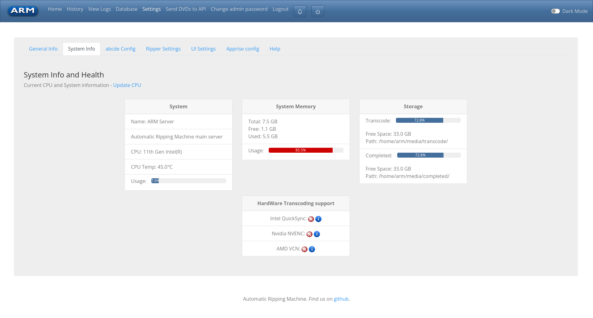
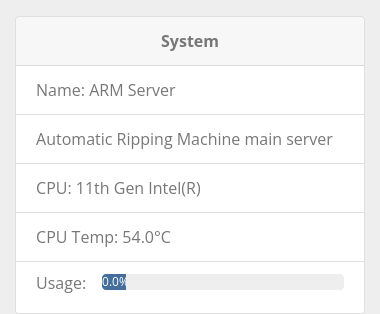
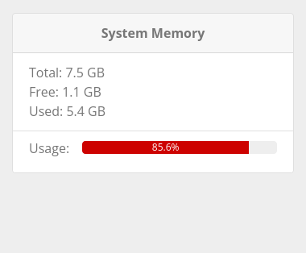
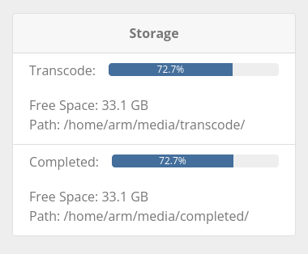
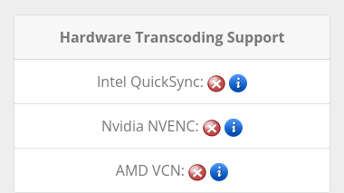
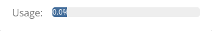
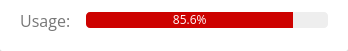

# ARM System Information
<!-- TOC -->
* [ARM System Information](#arm-system-information)
  * [Overview](#overview)
  * [System Information and Health](#system-information-and-health)
    * [System](#system)
    * [System Memory](#system-memory)
    * [Storage](#storage)
    * [Hardware Transcoding Support](#hardware-transcoding-support)
    * [Warnings and Alerts](#warnings-and-alerts)
<!-- TOC -->

## Overview

The ARM Settings page 'System Info' tab provides a snapshot of the system information and health.

## System Information and Health

### System

The 'System' card provides information on the ARM host.

| Field           | Description                                                                                        |
|-----------------|----------------------------------------------------------------------------------------------------|
| Name            | Name of the system, currently not user editable                                                    |
| Description     | Decription of the machine, currently not user editable                                             |
| CPU             | CPU information as gathered by ARM                                                                 |
| CPU Temperature | The current CPU core temperature See [Warnings and Alerts](#warnings-and-alerts) for more info |
| Usage           | CPU usage in percent See [Warnings and Alerts](#warnings-and-alerts) for more info             |

If this information is out of date due to a hardware change,
select 'Update CPU' and ARM will get new system information.

### System Memory

The 'System Memory' card provides information on the systems total and consumed memory aka. RAM.

| Field | Description                                                                               |
|-------|-------------------------------------------------------------------------------------------|
| Total | System total RAM                                                                          |
| Free  | Current (as of page refresh) unused or free RAM                                           |
| Used  | Current (as of page refresh) used RAM                                                     |
| Usage | Memory usage in percent See [Warnings and Alerts](#warnings-and-alerts) for more info |

### Storage

The 'Storage' card provides information on the systems storage usage

| Field     | Description                                                                                                                                                                               |
|-----------|-------------------------------------------------------------------------------------------------------------------------------------------------------------------------------------------|
| Transcode | Transcode, video and unprocessed data storage Docker volume `/home/arm/media`  see [Warnings and Alerts](#warnings-and-alerts) for more info                                      |
| Completed | Completed, completed video, music or other data once moved to the completed folder Docker volume `/home/arm/media`  See [Warnings and Alerts](#warnings-and-alerts) for more info |

### Hardware Transcoding Support

The 'Hardware Transcoding Support' card provides feedback on what hardware encoding the ARM Ripper has access to.

ARM support transcoding using Intel, AMD and Nvidia hardware.
For more information, refer to the specific section of the wiki below.

- [Adding Intel QSV Support](Hardware-Transcode-Intel-QSV)
- [Adding AMD VCE Support](Hardware-Transcode-AMD-VCE)
- [NVIDIA NVENC support](Hardware-Transcode-Nvidia-NVENC)

The page reports transcoding status as either success or fail
- Transcoding supported
  
- Transcoding not Supported
  

### Warnings and Alerts

Each of the progress bars when over 80% will change colour to indicate an issue or something requiring action.

Progress bar with no warning, showing usage at 0%

Progress bar with warning, showing usage at 85%

