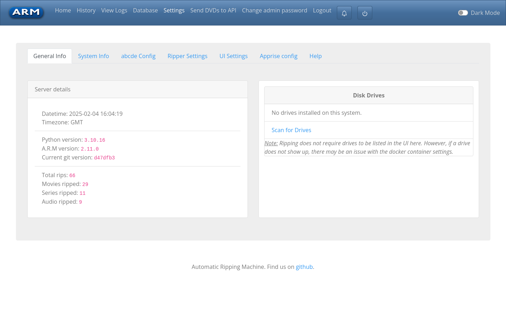
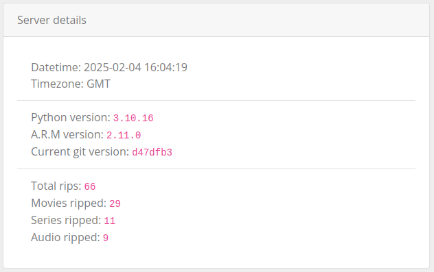
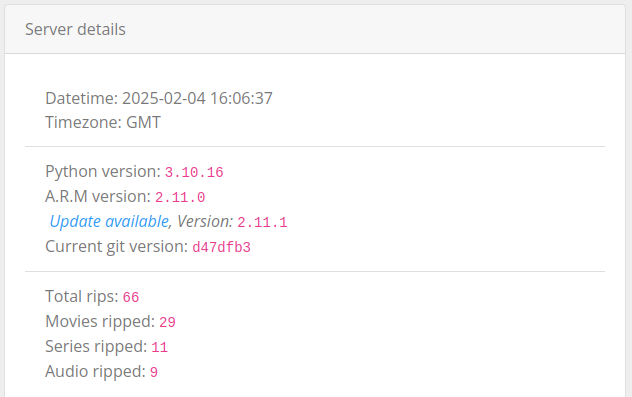
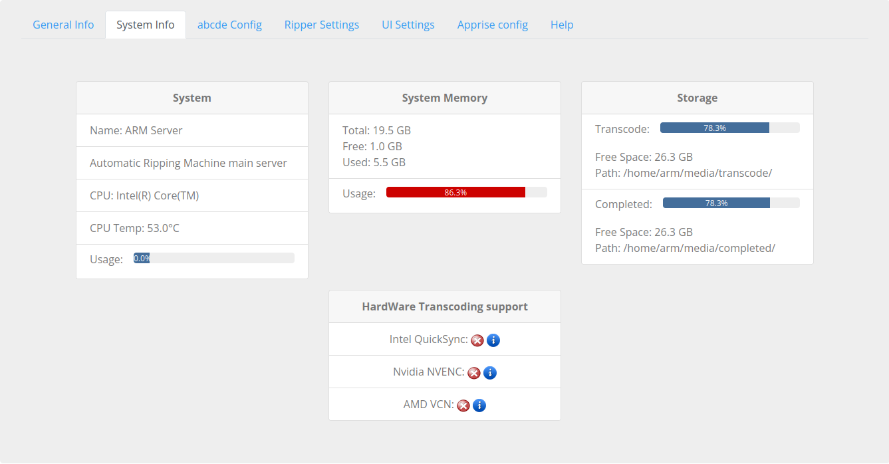
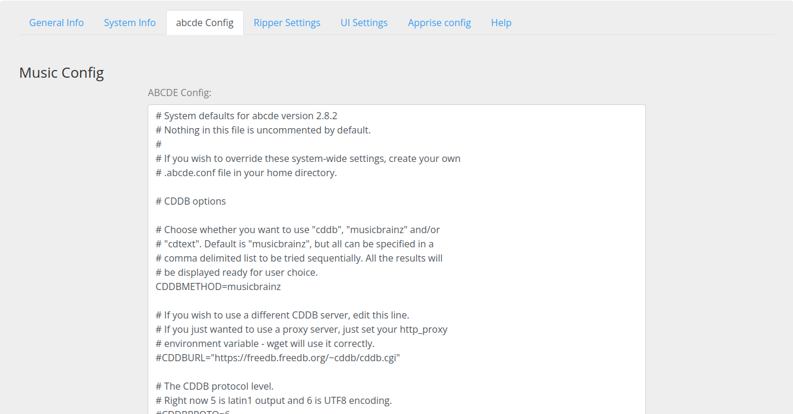
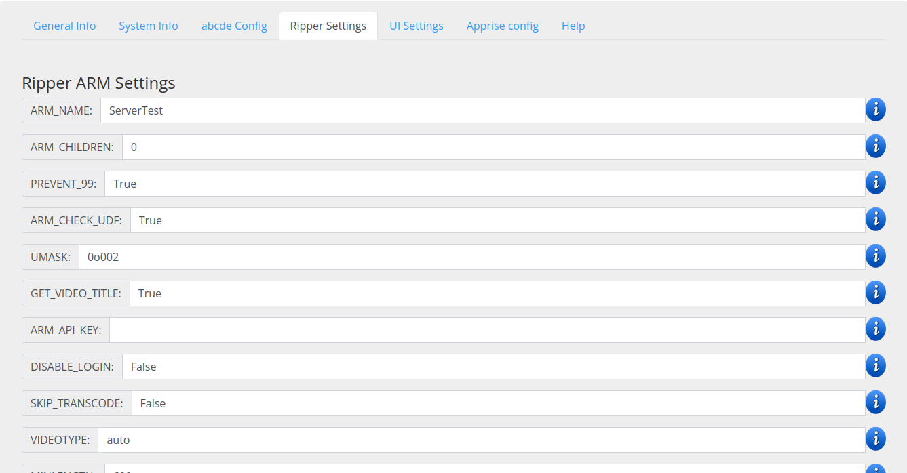
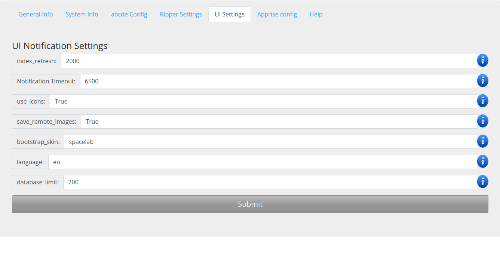
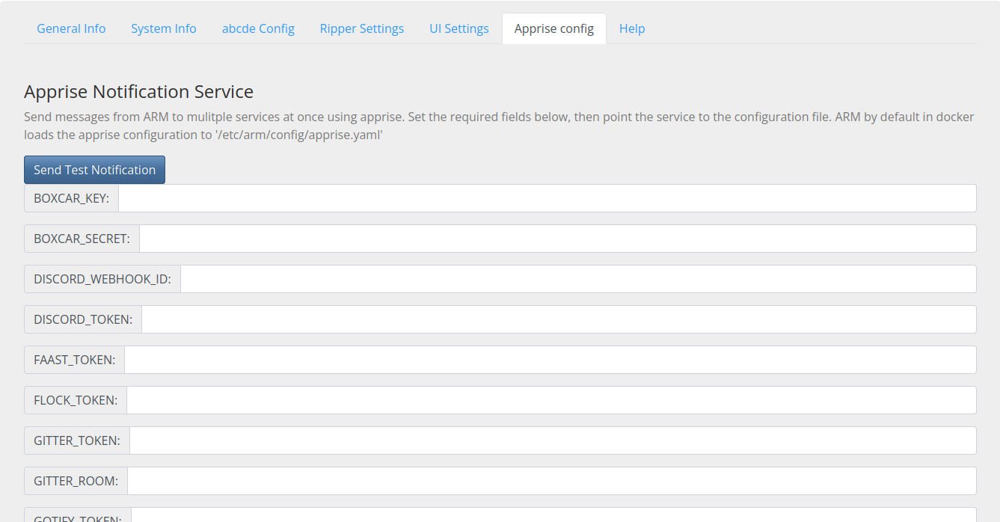

# ARM Settings

<!-- TOC -->
* [ARM Settings](#arm-settings)
  * [Overview](#overview)
  * [Settings](#settings)
    * [General Info](#general-info)
    * [System Info](#system-info)
    * [abcde Config](#abcde-config)
    * [Ripper Settings](#ripper-settings)
    * [UI Settings](#ui-settings)
    * [Apprise Config](#apprise-config)
<!-- TOC -->

## Overview

The ARM Settings page provides an overview of the system state, management of drives and ARM configuration Settings.

## Settings

### General Info

The General Info tab provides a high level summary of 'Server Details' and 'Disk Drives'.
See [Settings Drives](Web-Settings-Drives) on drive management.

The Server Details provide:
- Date and time info:
  - Datetime, the current date and time of the ARM Server
  - Timezone, the timezone configured for your server.
- System versions:
  - Python Version, the python version running ARM
  - ARM version, the current version running on the server
    - Update available, when an update is available ARM will show the new version here
    - See [Updating ARM](Docker-Upgrading) for details on how to update
  - Current Git Version, the current git commit running on the server
- Ripping Stats:
  - Total rips, total rips managed by ARM
  - Movies, total count of movies ripped
  - Series, total count of TV series ripped
  - Audi0, total count of Music CDs ripped

**System Information — No Update**

**System Information with an ARM Update**

### System Info

The System Info tab provides an overview of the current ARM server state.

### abcde Config

The .abcde Config configures how ARM handles Music discs.
ARM doesn't carry out any Music ripping, but passes the job off to the [.abcde package](https://abcde.einval.com/wiki/).
Configuration of the .abcde file from the UI allows for modification of the output format, folder structure, and any other
configuration possible via .abcde.

More info can be found on the [.abcde config](Config-abcde.conf) page.

### Ripper Settings

The Ripper Settings are the backbone of the ARM experience.
These configuration settings provide flexibility to back up, rip, transcode or ignore discs all together.

More info can be found on the [ARM config](Config-arm.yaml) page.

### UI Settings

The ARM UI settings adjust the presentation, alert duration and layout of the ARM Webpages (User Interface).

More info can be found on the [UI Settings](Web-Settings-UI) page.

### Apprise Config

The python [Apprise](https://github.com/caronc/apprise) package provides support for sending messages via a host of platforms.
ARM has integrated Apprise with the [apprise.yaml](Config-apprise.yaml) file, allowing for notifications external to ARM.

More info can be found on the [Apprise config](Config-apprise.yaml) page.

