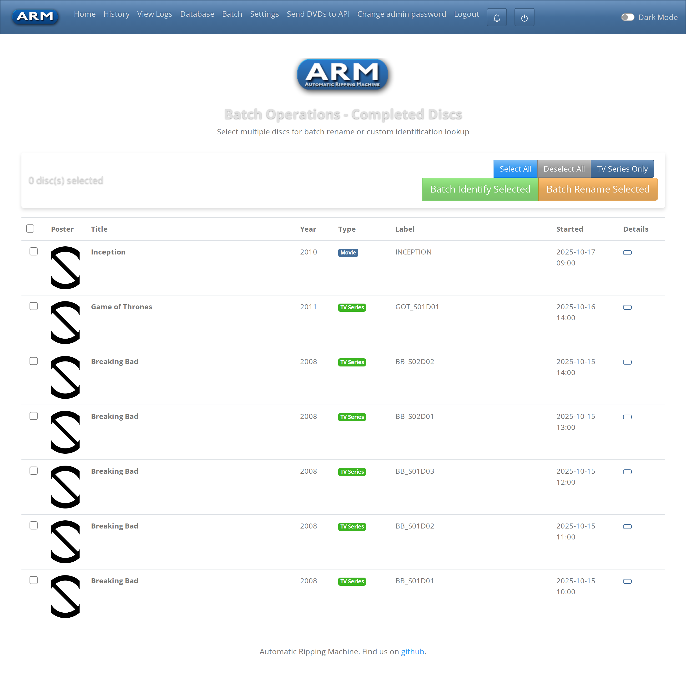
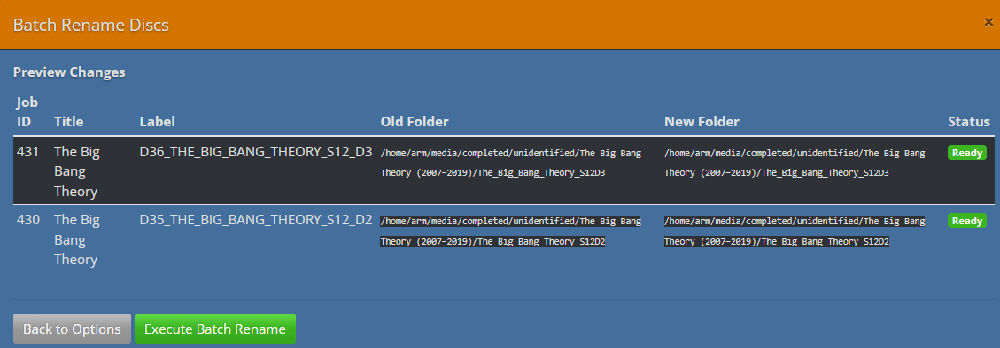
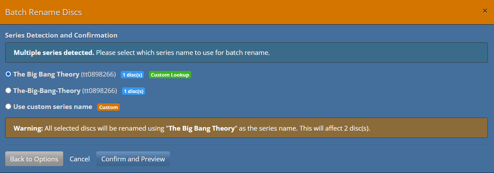
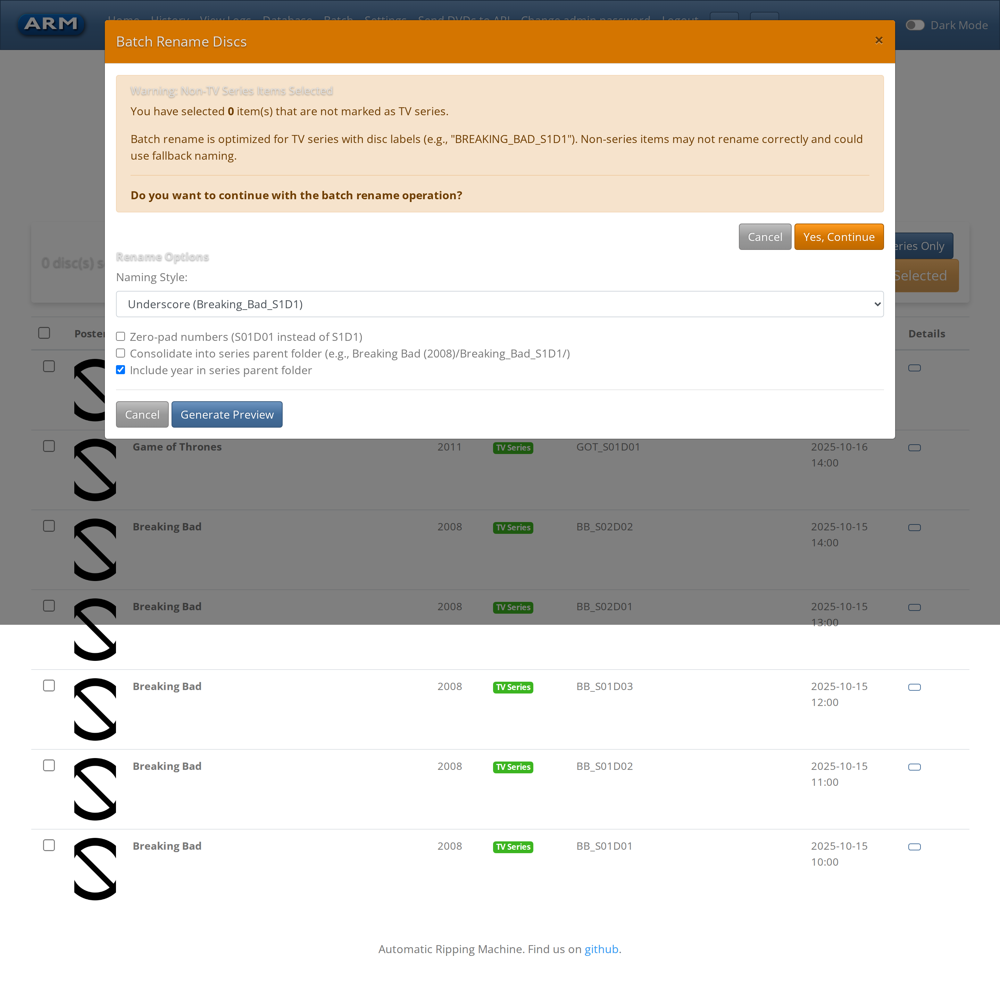
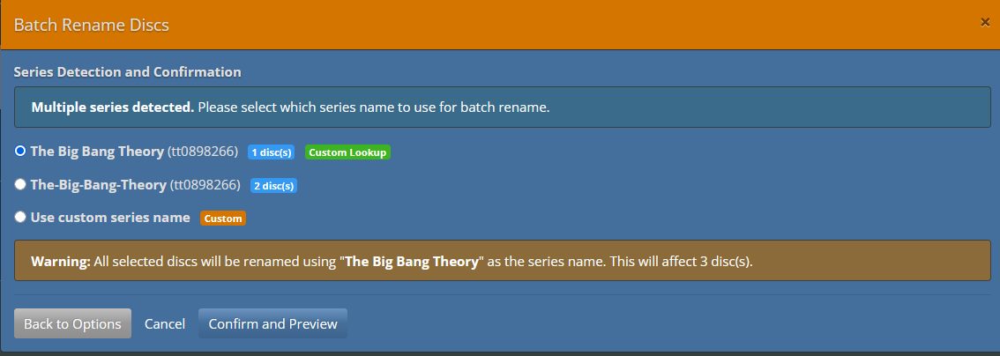
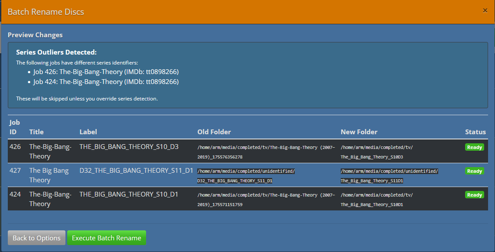
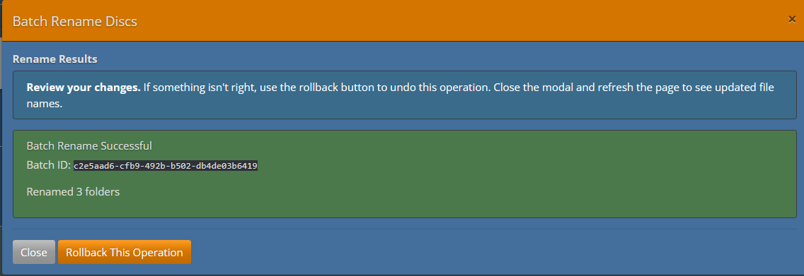

# Batch Rename Feature Demo

This document provides a step-by-step demonstration of the Batch Rename TV Series Discs feature using a sample Breaking Bad disc collection.

## Demo Scenario

**Goal:** Rename 5 Breaking Bad disc rips from inconsistent folder names to organized, disc-label-based names with series consolidation.

**Sample Data:**
- 5 completed rips of Breaking Bad seasons 1-2
- Disc labels: `BB_S01D01`, `BB_S01D02`, `BB_S01D03`, `BB_S02D01`, `BB_S02D02`
- Current folder names are inconsistent (timestamps, etc.)
- Want to consolidate under `Breaking Bad (2008)/` parent folder

## Setup

### 1. Enable Disc Label Feature (Optional but Recommended)

Edit `arm.yaml`:
```yaml
USE_DISC_LABEL_FOR_TV: true
```

This ensures future rips automatically use disc-label-based naming.

### 2. Configure Batch Rename Defaults

Edit `arm.yaml`:
```yaml
BATCH_RENAME_NAMING_STYLE: "underscore"
BATCH_RENAME_ZERO_PADDED: false
BATCH_RENAME_CONSOLIDATE_DEFAULT: true
```

These are defaults that will be pre-filled in the UI (can be overridden per batch).

### 3. Access ARM Web UI

Navigate to: `http://your-arm-server:8080`

## Demo Walkthrough

### Step 1: Navigate to Batch View

1. Click **"Batch"** in the navigation menu
2. You'll see all completed jobs listed

**What you see:**
```
Job List:
☑ Job 101: Breaking Bad - Status: success - Folder: Breaking Bad (2008)
☑ Job 102: Breaking Bad - Status: success - Folder: Breaking Bad (2008)_20250115_120000
☑ Job 103: Breaking Bad - Status: success - Folder: Breaking Bad (2008)_20250115_130000
☑ Job 104: Breaking Bad - Status: success - Folder: Breaking Bad (2008)_20250115_140000
☑ Job 105: Breaking Bad - Status: success - Folder: Breaking Bad (2008)_20250115_150000
```



### Step 2: Select Jobs for Batch Rename

**Action:** Check the boxes next to jobs 101-105

**What happens:**
- Checkboxes turn blue/checked
- "Batch Rename Selected" button becomes enabled
- Button text updates to "Batch Rename Selected (5)"



> **Note:** If you try to select a movie or incomplete job, you'll see a toast notification:
> "Only TV series can be batch renamed" or "Only completed jobs can be batch renamed"

### Step 3: Open Batch Rename Modal

**Action:** Click "Batch Rename Selected (5)"

**What happens:**
- Modal dialog opens
- Shows "Step 1: Rename Options"
- Default values loaded from arm.yaml



### Step 4: Configure Options

**Action:** Review and adjust settings

**Scenario A - Keep Defaults:**
- Naming Style: Underscore
- Zero-padded: No
- Consolidate: Yes
- Include year: Yes

**Scenario B - Custom:**
- Change to Hyphen style
- Enable zero-padding
- Uncheck "Include year"

For this demo, we'll use **Scenario A** (defaults).



### Step 5: Generate Preview

**Action:** Click "Generate Preview"

**What happens:**
- Button shows spinner: "⟳ Generating Preview..."
- AJAX call to `/batch_rename` with action='preview'
- Server validates jobs, detects series consistency, computes new names
- Preview table populates


**Key Points:**
- All jobs show **[✓ Ready]** badge (green)
- No warnings, outliers, or conflicts
- Old paths → New paths clearly shown
- Parent folder `Breaking Bad (2008)/` will be created

### Step 6: Review Preview (Outlier Detection Example)

**Alternate Scenario:** What if you accidentally selected a Game of Thrones disc?



**Action:** Click "Back to Options", deselect Job 106, regenerate preview.

### Step 7: Review Preview (Conflict Detection Example)

**Alternate Scenario:** What if `Breaking_Bad_S1D1` folder already exists?



**Action:** 
1. Close modal
2. Manually rename or delete the conflicting folder
3. Reopen batch rename and regenerate preview
4. Verify no conflicts, proceed

### Step 8: Execute Batch Rename

**Action:** Click "Execute Batch Rename"

**What happens:**
- Button shows spinner: "⟳ Executing..."
- AJAX call to `/batch_rename` with action='execute'
- Server performs filesystem operations:
  1. Creates `Breaking Bad (2008)/` parent folder
  2. Renames each disc folder to new location
  3. Updates database with new paths
  4. Records history for rollback
- Progress completes in ~2-5 seconds



**Toast Notification:**
```
✅ Batch rename successful: 5 folders renamed
```

### Step 9: Verify Changes

**Action:** Check the filesystem

**Before:**
```bash
$ ls -1 /home/arm/media/
Breaking Bad (2008)
Breaking Bad (2008)_20250115_120000
Breaking Bad (2008)_20250115_130000
Breaking Bad (2008)_20250115_140000
Breaking Bad (2008)_20250115_150000
```

**After:**
```bash
$ ls -1 /home/arm/media/
Breaking Bad (2008)/

$ ls -1 /home/arm/media/Breaking\ Bad\ \(2008\)/
Breaking_Bad_S1D1/
Breaking_Bad_S1D2/
Breaking_Bad_S1D3/
Breaking_Bad_S2D1/
Breaking_Bad_S2D2/
```


**Database Check:**

Navigate to Database view → Jobs 101-105 now show new folder paths:
```
Job 101: Breaking Bad (2008)/Breaking_Bad_S1D1
Job 102: Breaking Bad (2008)/Breaking_Bad_S1D2
Job 103: Breaking Bad (2008)/Breaking_Bad_S1D3
Job 104: Breaking Bad (2008)/Breaking_Bad_S2D1
Job 105: Breaking Bad (2008)/Breaking_Bad_S2D2
```


### Step 10: Rollback (Demo)

**Scenario:** You decide you don't like the consolidation, want to undo.

**Action:** Click "Rollback This Operation" (or use Database view)

**Confirmation Dialog:**
```
Are you sure you want to rollback this batch rename operation?
This will restore the original folder names.

[Cancel]  [Yes, Rollback]
```

**What happens:**
- AJAX call to `/batch_rename` with action='rollback', batch_id
- Server restores all original folder names
- Updates database to old paths
- Marks batch as "rolled back"


**After Rollback:**
```bash
$ ls -1 /home/arm/media/
Breaking Bad (2008)
Breaking Bad (2008)_20250115_120000
Breaking Bad (2008)_20250115_130000
Breaking Bad (2008)_20250115_140000
Breaking Bad (2008)_20250115_150000
```

> **Note:** The parent folder `Breaking Bad (2008)/` is removed if empty.

## Demo Variations

### Variation 1: Different Naming Styles

Try each style to see the output:

**Underscore:**
```
Breaking_Bad_S1D1
Breaking_Bad_S1D2
```

**Hyphen:**
```
breaking-bad-s1d1
breaking-bad-s1d2
```

**Space:**
```
Breaking Bad S1D1
Breaking Bad S1D2
```

### Variation 2: Zero-Padding

Enable zero-padding for consistent width:

**Without:**
```
Breaking_Bad_S1D1
Breaking_Bad_S1D10
Breaking_Bad_S2D1
```
(S1D10 sorts incorrectly between S1D1 and S2D1 alphabetically)

**With:**
```
Breaking_Bad_S01D01
Breaking_Bad_S01D10
Breaking_Bad_S02D01
```
(Correct alphabetical sort)

### Variation 3: No Consolidation

Disable consolidation for flat structure:

**Output:**
```bash
$ ls -1 /home/arm/media/
Breaking_Bad_S1D1/
Breaking_Bad_S1D2/
Breaking_Bad_S1D3/
Breaking_Bad_S2D1/
Breaking_Bad_S2D2/
```

## Demo Script for Testing

Use this script to create sample data for testing:

```bash
#!/bin/bash
# demo_setup.sh - Create sample TV series folders for batch rename testing

MEDIA_DIR="/home/arm/media"
SERIES="Breaking Bad"
YEAR="2008"

# Create 5 sample folders with timestamps
mkdir -p "$MEDIA_DIR/$SERIES ($YEAR)"
mkdir -p "$MEDIA_DIR/$SERIES ($YEAR)_20250115_120000"
mkdir -p "$MEDIA_DIR/$SERIES ($YEAR)_20250115_130000"
mkdir -p "$MEDIA_DIR/$SERIES ($YEAR)_20250115_140000"
mkdir -p "$MEDIA_DIR/$SERIES ($YEAR)_20250115_150000"

# Add dummy video files
for dir in "$MEDIA_DIR"/$SERIES*; do
    touch "$dir/video.mkv"
    echo "Created: $dir"
done

echo "Sample folders created for batch rename demo"
```

**Database setup:**
```sql
-- Insert sample jobs (adjust IDs and paths as needed)
INSERT INTO jobs (job_id, title, year, video_type, hasnicetitle, job_length, 
                  disctype, label, path, status)
VALUES 
(101, 'Breaking Bad', '2008', 'series', 1, '45:00', 'bluray', 'BB_S01D01', 
 '/home/arm/media/Breaking Bad (2008)', 'success'),
(102, 'Breaking Bad', '2008', 'series', 1, '45:00', 'bluray', 'BB_S01D02',
 '/home/arm/media/Breaking Bad (2008)_20250115_120000', 'success'),
(103, 'Breaking Bad', '2008', 'series', 1, '45:00', 'bluray', 'BB_S01D03',
 '/home/arm/media/Breaking Bad (2008)_20250115_130000', 'success'),
(104, 'Breaking Bad', '2008', 'series', 1, '45:00', 'bluray', 'BB_S02D01',
 '/home/arm/media/Breaking Bad (2008)_20250115_140000', 'success'),
(105, 'Breaking Bad', '2008', 'series', 1, '45:00', 'bluray', 'BB_S02D02',
 '/home/arm/media/Breaking Bad (2008)_20250115_150000', 'success');
```

## Expected Outcomes

### Success Criteria

✅ All 5 jobs renamed successfully  
✅ Parent folder created with correct name  
✅ Disc folders use consistent naming  
✅ Database paths updated  
✅ Batch history recorded  
✅ Rollback restores original state  

### Common Issues and Solutions

| Issue | Cause | Solution |
|-------|-------|----------|
| Jobs can't be selected | Not TV series or not complete | Only select series jobs with success status |
| Preview shows "Skipped" | Missing disc label or outlier | Check disc label format, deselect outliers |
| Conflict error | Target folder exists | Rename/delete conflicting folder |
| Rollback fails | Folders manually modified | Rollback requires unchanged renamed folders |

## Performance Notes

- **Preview generation:** <1 second for 5 jobs, ~2-3 seconds for 50 jobs
- **Execution:** <5 seconds for 5 jobs (mostly filesystem I/O)
- **Rollback:** <3 seconds for 5 jobs

## Conclusion

The Batch Rename feature provides:
- ✅ Safe, preview-based renaming
- ✅ Flexible naming options
- ✅ Full rollback capability
- ✅ Comprehensive audit trail

Perfect for organizing completed TV series rips with consistent, discoverable folder names.

---

**Next Steps:**
- Try the demo with your own disc collection
- Experiment with different naming styles
- Test the rollback feature
- Check the [Full Wiki Documentation](Batch-Rename-TV-Series) for details
